<p align="center">
  
</p>

<h1 align="center">awaitly</h1>

<p align="center">
  <em>Good things come to those who a-<strong>wait</strong>-ly.</em>
</p>

Stop writing `try/catch` in every async handler.

awaitly lets you:
- return errors as data (`ok` / `err`)
- compose async steps linearly
- TypeScript knows **all possible errors** automatically
- map errors at the boundary (HTTP, RPC, jobs)

No exceptions for expected failures. No manual error unions.

```bash
npm install awaitly
```

For minimal bundle use `awaitly/result`; for Awaitly namespace and full API use `awaitly`.

📚 **[Full Documentation](https://jagreehal.github.io/awaitly/)** - guides, API reference, and examples.

---

## The Problem

JavaScript async code conflates two kinds of failures:

- **Expected**: "User not found", "Payment declined" — these are business outcomes
- **Unexpected**: Network timeout, SDK crash, OOM — these are bugs

Traditional try/catch loses type information:

```typescript
try {
  const user = await getUser(id);
  const order = await createOrder(user);
} catch (error) {
  // What type is error? unknown.
  // Was it "user not found" or a network crash? No idea.
}
```

awaitly separates these: expected failures become typed data, unexpected failures become `UnexpectedError`.

---

## Results as Data

Functions that can fail return `AsyncResult<SuccessType, ErrorType>`:

```typescript
import { ok, err, type AsyncResult } from "awaitly";

type User = { id: string; name: string };
type UserNotFound = { type: "USER_NOT_FOUND"; userId: string };

async function getUser(id: string): AsyncResult<User, UserNotFound> {
  if (id === "u-1") return ok({ id, name: "Alice" });
  return err({ type: "USER_NOT_FOUND", userId: id });
}

const result = await getUser("u-2");
if (result.ok) {
  console.log(result.value.name); // TypeScript knows this is User
} else {
  console.log(result.error.userId); // TypeScript knows this is UserNotFound
}
```

No exceptions. TypeScript tracks every possible error.

---

## The Composition Problem

When you compose multiple Result-returning functions, you hit boilerplate:

```typescript
// ❌ Every call needs: if (!result.ok) return result
async function processOrder(orderId: string) {
  const orderResult = await getOrder(orderId);
  if (!orderResult.ok) return orderResult; // boilerplate

  const userResult = await getUser(orderResult.value.userId);
  if (!userResult.ok) return userResult; // more boilerplate

  const paymentResult = await charge(orderResult.value.total);
  if (!paymentResult.ok) return paymentResult; // even more

  return paymentResult;
}
```

10 steps = 10 if-checks. This is what `step()` solves.

---

## run() — Simple Composition

`run()` gives you a `step()` function that unwraps Results automatically:

```typescript
import { run } from "awaitly/run";

const result = await run(async (step) => {
  const order = await step('getOrder', () => getOrder(orderId)); // unwraps ok, exits on err
  const user = await step('getUser', () => getUser(order.userId)); // same
  const payment = await step('charge', () => charge(order.total)); // same
  return payment;
});
```

**The happy path reads linearly.** No if-checks.

### Why thunks? `step('id', () => fn())` not `step('id', fn())`

`step()` requires a string ID as the first argument. Always wrap the operation in a function (thunk):

```typescript
step('getUser', () => getUser(id)); // ✅ Correct - step controls when it runs
step('getUser', getUser(id)); // ❌ Wrong - executes immediately
```

Thunks enable:

- **Caching**: step checks cache before calling
- **Retries**: step can re-call on failure
- **Timeouts**: step can abort mid-execution

### UnexpectedError — The Safety Net

If code throws instead of returning a Result, `run()` catches it:

```typescript
import { UNEXPECTED_ERROR } from "awaitly/workflow";

if (!result.ok && result.error.type === UNEXPECTED_ERROR) {
  console.error("Bug or SDK error:", result.error.cause);
}
```

- **Expected failures** → your typed errors
- **Unexpected failures** → `UnexpectedError`

TypeScript forces you to handle both.

---

## createWorkflow — Production API

`run()` requires manual error type declaration. `createWorkflow()` infers them automatically:

```typescript
import { createWorkflow } from "awaitly/workflow";

const deps = {
  getUser: async (id: string): AsyncResult<User, UserNotFound> => {
    /* ... */
  },
  getOrder: async (id: string): AsyncResult<Order, OrderNotFound> => {
    /* ... */
  },
};

const workflow = createWorkflow(deps);

const result = await workflow(async (step, deps) => {
  const user = await step('getUser', () => deps.getUser(userId));
  const order = await step('getOrder', () => deps.getOrder(orderId));
  return { user, order };
});
// TypeScript KNOWS: result.error is UserNotFound | OrderNotFound | UnexpectedError
```

### When to use which?

| `run()`                        | `createWorkflow()`             |
| ------------------------------ | ------------------------------ |
| Simple one-off composition     | Production handlers            |
| Explicit error types           | Automatic error inference      |
| Building abstractions          | Caching, retries, events       |

---

## How It Works

```mermaid
flowchart TD
    subgraph "step('id', fn) unwraps Results, exits early on error"
        S1["step('fetchUser', () => deps.fetchUser(...))"] -->|ok| S2["step('fetchPosts', () => deps.fetchPosts(...))"]
        S2 -->|ok| S3["step('sendEmail', () => deps.sendEmail(...))"]
        S3 -->|ok| S4["✓ Success"]

        S1 -.->|error| EXIT["Return error"]
        S2 -.->|error| EXIT
        S3 -.->|error| EXIT
    end
```



Each `step()` unwraps a `Result`. If it's `ok`, you get the value and continue. If it's an error, the workflow exits immediately — no manual `if (!result.ok)` checks needed. The happy path stays clean.

---

## Key Concepts

| Concept             | What it does                                                                             |
| ------------------- | ---------------------------------------------------------------------------------------- |
| **Result**          | `ok(value)` or `err(error)` — typed success/failure, no exceptions                       |
| **Workflow**        | Wraps your dependencies and tracks their error types automatically                       |
| **step()**          | `step('id', fn, opts?)` — unwraps a Result, short-circuits on failure, enables caching/retries |
| **step.try / retry / sleep / withTimeout / fromResult** | Same: **id first** (e.g. `step.retry('id', fn, opts)`, `step.sleep('id', duration, opts?)`) |
| **Events**          | `onEvent` streams everything — timing, retries, failures — for visualization or logging  |
| **Resume**          | Save completed steps, pick up later (great for approvals or crashes)                     |
| **UnexpectedError** | Safety net for throws outside your declared errors; map it to HTTP 500 at the boundary   |

---

## Quickstart

Now that you understand the concepts, here's the complete pattern:

```typescript
import { ok, err, type AsyncResult } from "awaitly";
import { createWorkflow } from "awaitly/workflow";

type Task = { id: string };
type TaskNotFound = { type: "TASK_NOT_FOUND"; id: string };

// 1. Define dependencies that return Results
const deps = {
  loadTask: async (id: string): AsyncResult<Task, TaskNotFound> => {
    if (id === "t-1") return ok({ id });
    return err({ type: "TASK_NOT_FOUND", id });
  },
};

// 2. Create and run a workflow
const workflow = createWorkflow(deps);

const result = await workflow(async (step, deps) => {
  return await step('loadTask', () => deps.loadTask("t-1"));
});

// 3. Handle the result
console.log(result.ok ? result.value : result.error);
```

### What just happened?

- `deps.loadTask` returns a Result (`ok` or `err`)
- `createWorkflow(deps)` groups dependencies and infers all possible errors
- `step('id', () => ...)` runs the operation and unwraps the success value
- if a step returns `err`, the workflow exits early

---

## Before & After: See Why This Matters

Let's build a money transfer - a real-world case where error handling matters. Same operation, two different approaches.

**Traditional approach: try/catch with manual error handling**

```typescript
// ❌ TypeScript sees: Promise<{ transactionId: string } | { error: string }>
async function transferMoney(
  fromUserId: string,
  toUserId: string,
  amount: number
): Promise<{ transactionId: string } | { error: string }> {
  try {
    // Get sender - but what if this throws? What type of error?
    const fromUser = await getUser(fromUserId);
    if (!fromUser) {
      return { error: "User not found" }; // Lost type information! Which user?
    }

    // Get recipient
    const toUser = await getUser(toUserId);
    if (!toUser) {
      return { error: "User not found" }; // Same generic error - can't distinguish
    }

    // Validate balance
    if (fromUser.balance < amount) {
      return { error: "Insufficient funds" }; // No details about how much needed
    }

    // Execute transfer
    const transaction = await executeTransfer(fromUser, toUser, amount);
    if (!transaction) {
      return { error: "Transfer failed" }; // No reason why - was it network? DB? API?
    }

    return transaction;
  } catch (error) {
    // What kind of error? Unknown! Could be network, database, anything
    // TypeScript can't help you here - it's all `unknown`
    return { error: error instanceof Error ? error.message : "Unknown error" };
  }
}

// Helper functions that return null on failure (typical pattern)
async function getUser(userId: string): Promise<{ id: string; balance: number } | null> {
  // Simulate: might throw, might return null - who knows?
  if (userId === "unknown") return null;
  return { id: userId, balance: 1000 };
}

async function executeTransfer(
  from: { id: string },
  to: { id: string },
  amount: number
): Promise<{ transactionId: string } | null> {
  // Might fail for many reasons - all become null
  return { transactionId: "tx-12345" };
}
```

**With workflow: typed errors, automatic inference, clean code**

```typescript
import { ok, err, type AsyncResult } from "awaitly";
import { createWorkflow, UNEXPECTED_ERROR } from "awaitly/workflow";

type User = { id: string; balance: number };
type UserNotFound = { type: "USER_NOT_FOUND"; userId: string };
type InsufficientFunds = { type: "INSUFFICIENT_FUNDS"; required: number; available: number };
type TransferFailed = { type: "TRANSFER_FAILED"; reason: string };

const deps = {
  getUser: async (userId: string): AsyncResult<User, UserNotFound> => {
    if (userId === "unknown") return err({ type: "USER_NOT_FOUND", userId });
    return ok({ id: userId, balance: 1000 });
  },

  validateBalance: (user: User, amount: number): AsyncResult<void, InsufficientFunds> => {
    if (user.balance < amount) {
      return err({ type: "INSUFFICIENT_FUNDS", required: amount, available: user.balance });
    }
    return ok(undefined);
  },

  executeTransfer: async (): AsyncResult<{ transactionId: string }, TransferFailed> => {
    return ok({ transactionId: "tx-12345" });
  },
};

const transfer = createWorkflow(deps);

// In an HTTP handler
async function handler(fromUserId: string, toUserId: string, amount: number) {
  const result = await transfer(async (step, deps) => {
    const fromUser = await step('getUser', () => deps.getUser(fromUserId));
    const toUser = await step('getUser', () => deps.getUser(toUserId));
    await step('validateBalance', () => deps.validateBalance(fromUser, amount));
    return await step('executeTransfer', () => deps.executeTransfer());
  });

  // TypeScript knows ALL possible errors - map them to HTTP responses
  if (result.ok) return { statusCode: 200, body: result.value };

  switch (result.error.type) {
    case "USER_NOT_FOUND":
      return { statusCode: 404, body: { message: "User not found", userId: result.error.userId } };
    case "INSUFFICIENT_FUNDS":
      return { statusCode: 400, body: result.error };
    case "TRANSFER_FAILED":
    case UNEXPECTED_ERROR:
      return { statusCode: 500, body: { message: "Internal error" } };
  }
}
```

**How it works:** TypeScript knows **all possible errors** from your dependencies. Add a step? The errors update automatically. Remove one? They update. You'll never miss an error case.

---

## Mental model

Think of awaitly like this:

- Leaf functions return data OR an error (never throw for expected cases)
- A workflow runs steps in order
- `step()`:
  - gives you the value on success
  - exits immediately on error
- The boundary (HTTP, job, CLI) decides how to respond

---

## Mapping errors at the boundary

The final result maps cleanly to HTTP responses, job statuses, or CLI exit codes:

```typescript
import { UNEXPECTED_ERROR } from "awaitly/workflow";

// In an HTTP handler
if (result.ok) {
  return { statusCode: 200, body: result.value };
}

switch (result.error.type) {
  case "TASK_NOT_FOUND":
    return { statusCode: 404, body: { message: "Task not found" } };

  case UNEXPECTED_ERROR:
    // Log the cause for debugging (it's the original thrown error)
    console.error("Unexpected error:", result.error.cause);
    return { statusCode: 500, body: { message: "Internal error" } };

  default:
    return { statusCode: 500, body: { message: "Internal error" } };
}
```

**Why `UnexpectedError`?**
- Expected failures → your typed errors (e.g., `TASK_NOT_FOUND`)
- Unexpected failures (bugs, SDK throws) → `UnexpectedError`

TypeScript will force you to handle both. This is intentional.

---

## Key Features

### 🛡️ Built-in Reliability

Add resilience exactly where you need it - no nested try/catch or custom retry loops.

```typescript
const result = await workflow(async (step, deps) => {
  // Retry 3 times with exponential backoff, timeout after 5 seconds
  const task = await step.retry("loadTask", () => deps.loadTask("t-1"), {
    attempts: 3,
    backoff: "exponential",
    timeout: { ms: 5000 },
  });
  return task;
});
```

### 💾 Smart Caching (Never Double-Charge a Customer)

Use stable keys to ensure a step only runs once, even if the workflow crashes and restarts.

```typescript
const result = await processPayment(async (step) => {
  // If the workflow crashes after charging but before saving,
  // the next run skips the charge - it's already cached.
  const charge = await step('chargeCard', () => chargeCard(amount), {
    key: `charge:${order.idempotencyKey}`,
  });

  await step('saveToDatabase', () => saveToDatabase(charge), {
    key: `save:${charge.id}`,
  });

  return charge;
});
```

### 💾 Save & Resume (Persist Workflows Across Restarts)

Save workflow state to a database and resume later from exactly where you left off. Perfect for long-running workflows, crash recovery, or pausing for approvals.

**Step 1: Collect state during execution**

```typescript
import { createWorkflow, createResumeStateCollector } from 'awaitly/workflow';

// Create a collector to automatically capture step results
const collector = createResumeStateCollector();

const workflow = createWorkflow({ fetchUser, fetchPosts }, {
  onEvent: collector.handleEvent, // Automatically collects step_complete events
});

await workflow(async (step, deps) => {
  // Only steps with keys are saved
  const user = await step('fetchUser', () => deps.fetchUser("1"), { key: "user:1" });
  const posts = await step('fetchPosts', () => deps.fetchPosts(user.id), { key: `posts:${user.id}` });
  return { user, posts };
});

// Get the collected state
const state = collector.getResumeState(); // Returns ResumeState
```

**Step 2: Save to database**

```typescript
import { stringifyState, parseState } from 'awaitly/persistence';

// Serialize to JSON
const workflowId = "123";
const json = stringifyState(state, { workflowId, timestamp: Date.now() });

// Save to your database
await db.workflowStates.create({
  id: workflowId,
  state: json,
  createdAt: new Date(),
});
```

**Step 3: Resume from saved state**

```typescript
// Load from database
const workflowId = "123";
const saved = await db.workflowStates.findUnique({ where: { id: workflowId } });
const savedState = parseState(saved.state);

// Resume workflow - cached steps skip execution
const workflow = createWorkflow({ fetchUser, fetchPosts }, {
  resumeState: savedState, // Pre-populates cache from saved state
});

await workflow(async (step, deps) => {
  const user = await step('fetchUser', () => deps.fetchUser("1"), { key: "user:1" }); // ✅ Cache hit
  const posts = await step('fetchPosts', () => deps.fetchPosts(user.id), { key: `posts:${user.id}` }); // ✅ Cache hit
  return { user, posts };
});
```

**With database adapter (Redis, DynamoDB, etc.)**

```typescript
import { createStatePersistence } from 'awaitly/persistence';
import { createClient } from 'redis';

const redis = createClient();
await redis.connect();

// Create persistence adapter
const persistence = createStatePersistence({
  get: (key) => redis.get(key),
  set: (key, value) => redis.set(key, value),
  delete: (key) => redis.del(key).then(n => n > 0),
  exists: (key) => redis.exists(key).then(n => n > 0),
  keys: (pattern) => redis.keys(pattern),
}, 'workflow:state:');

// Save
await persistence.save(runId, state, { metadata: { userId: 'user-1' } });

// Load
const savedState = await persistence.load(runId);

// Resume
const workflow = createWorkflow(deps, { resumeState: savedState });
```

**Key points:**
- Only steps with `key` options are saved (unkeyed steps execute fresh on resume)
- Error results are preserved with metadata for proper replay
- You can also pass an async function: `resumeState: async () => await loadFromDB()`
- Works seamlessly with HITL approvals and crash recovery

### 🧑‍💻 Human-in-the-Loop

Pause for manual approvals (large transfers, deployments, refunds) and resume exactly where you left off.

```typescript
const requireApproval = createApprovalStep({
  key: 'approve:refund',
  checkApproval: async () => {
    const status = await db.getApprovalStatus('refund_123');
    return status ? { status: 'approved', value: status } : { status: 'pending' };
  },
});

const result = await refundWorkflow(async (step, deps) => {
  const refund = await step('calculateRefund', () => deps.calculateRefund(orderId));

  // Workflow pauses here until someone approves
  const approval = await step('approve', () => requireApproval(), { key: "approve:refund" });

  return await step('processRefund', () => deps.processRefund(refund, approval));
});

if (!result.ok && isPendingApproval(result.error)) {
  // Notify Slack, send email, etc.
  // Later: injectApproval(savedState, { stepKey, value })
}
```

### 📊 Visualize What Happened

Hook into the event stream to generate diagrams for logs, PRs, or dashboards.

```typescript
import { createVisualizer } from 'awaitly-visualizer';

const viz = createVisualizer({ workflowName: 'checkout' });
const workflow = createWorkflow({ fetchOrder, chargeCard }, {
  onEvent: viz.handleEvent,
});

await workflow(async (step, deps) => {
  const order = await step("fetchOrder", () => deps.fetchOrder("order_456"));
  const payment = await step("chargeCard", () => deps.chargeCard(order.total));
  return { order, payment };
});

console.log(viz.renderAs('mermaid'));
```

---

## What's next?

You have the foundation. Pick one:

- **If you need retries/timeouts:** [Reliability guide](https://jagreehal.github.io/awaitly/advanced/policies/)
- **If you need crash recovery:** [Persistence guide](https://jagreehal.github.io/awaitly/guides/persistence/)
- **If you want observability:** [Visualization guide](https://jagreehal.github.io/awaitly/guides/visualization/)

## Advanced Features (when you need them)

- **Retries / timeouts / backoff** → [Reliability guide](https://jagreehal.github.io/awaitly/advanced/policies/)
- **Step caching with keys** → [Caching guide](https://jagreehal.github.io/awaitly/guides/caching/)
- **Save & resume** → [Persistence guide](https://jagreehal.github.io/awaitly/guides/persistence/)
- **Human-in-the-loop approvals** → [HITL guide](https://jagreehal.github.io/awaitly/guides/human-in-loop/)
- **Visualization via `onEvent`** → [Visualization guide](https://jagreehal.github.io/awaitly/guides/visualization/)

---

## Common Patterns (quick reference)

```typescript
// Wrap throwing code — id first, then operation, then options
const data = await step.try("fetch", () => fetch(url).then((r) => r.json()), { error: "HTTP_FAILED" as const });

// Retries with backoff — id first
const user = await step.retry("fetchUser", () => deps.fetchUser(id), { attempts: 3, backoff: "exponential" });

// Timeout protection — id first
const result = await step.withTimeout("slowOp", () => deps.slowOperation(), { ms: 5000 });

// Caching (use thunk + key)
const user = await step("fetchUser", () => deps.fetchUser(id), { key: `user:${id}` });
```

---

## Processing Collections

Use `step.forEach()` for statically analyzable loops instead of manual `for` loops with dynamic keys:

```typescript
// ❌ Problematic - dynamic keys defeat static analysis
for (const payment of payments) {
  await step('processPayment', () => processPayment(payment), { key: `payment-${payment.id}` });
}

// ✅ Better - step.forEach() is statically analyzable
await step.forEach('process-payments', payments, {
  stepIdPattern: 'payment-{i}',
  run: async (payment) => {
    await step('processPayment', () => processPayment(payment));
  },
});
```

`step.forEach()` provides:
- Static analysis support (awaitly-analyze can enumerate paths)
- Automatic indexing with `stepIdPattern`
- Resume support (tracks which items completed)

---

## Strict Mode (Closed Error Unions)

By default, workflows include `UnexpectedError` in the error union. Use strict mode for closed error unions:

```typescript
// Default - open error union includes UnexpectedError
const workflow = createWorkflow(deps);
// Result error: 'NOT_FOUND' | 'ORDER_FAILED' | UnexpectedError

// Strict mode - closed error union
const workflow = createWorkflow(deps, {
  strict: true,
  errors: ['NOT_FOUND', 'ORDER_FAILED'] as const,
  catchUnexpected: (cause) => ({ type: 'UNEXPECTED' as const, cause })
});
// Result error: 'NOT_FOUND' | 'ORDER_FAILED' | { type: 'UNEXPECTED', cause }
```

With strict mode, TypeScript will error if a dep can produce an undeclared error.

---

## When to use awaitly

**Use it when:**
- You want Result types with async/await (not method chains)
- You need automatic error inference from dependencies
- You're building workflows that benefit from caching, retries, or resume

**Skip it when:**
- You prefer functional chaining (consider neverthrow)

### vs neverthrow

| awaitly | neverthrow |
|---------|-----------|
| async/await with `step('id', fn)` | `.andThen()` method chains |
| Automatic error inference | Manual error unions |
| Built-in retries, timeouts, caching | DIY |

**neverthrow:** Minimal bundle, functional chaining.
**awaitly:** async/await syntax + orchestration built in.

## Quick Reference

| API | Description |
|-----|-------------|
| `createWorkflow(deps)` | Recommended. Auto-infers errors from deps. |
| `step('id', () => deps.fn())` | Run a step, unwrap result. ID required. |
| `step.retry(id, fn, opts)` | Retry with backoff. ID required. |
| `step.withTimeout(id, fn, { ms })` | Timeout protection. ID required. |
| `step.try(id, fn, opts)` | Wrap throwing code; map to typed error. ID required. |
| `step.sleep(id, duration, opts?)` | Pause execution. ID required. |
| `ok(value)` / `err(error)` | Construct Results. |

See [full API reference](https://jagreehal.github.io/awaitly/reference/api/) for `run()`, `step.fromResult`, combinators, circuit breakers, and more.

### run()

Most users do NOT need `run()`.

Use it only when:
- dependencies are passed dynamically as parameters
- you want explicit control over the error union
- you're building abstractions on top of awaitly

```typescript
import { run } from "awaitly/run";

const result = await run<Output, "NOT_FOUND" | "FETCH_ERROR">(
  async (step) => {
    const user = await step('fetchUser', () => fetchUser(userId)); // thunk for consistency
    return user;
  },
  { onError: (e) => console.log("Failed:", e) }
);
```

For most cases, stick with `createWorkflow()` which infers error types automatically.

### Imports

Most apps only need:

```typescript
import { ok, err, type AsyncResult } from "awaitly";
import { createWorkflow, UNEXPECTED_ERROR } from "awaitly/workflow";
```

Everything else is optional and documented in the [guides](https://jagreehal.github.io/awaitly/).

## Common Pitfalls

**Use thunks for caching.** `step('fetchUser', deps.fetchUser('1'))` executes immediately. Use `step('fetchUser', () => deps.fetchUser('1'), { key })` for caching to work.

**Keys must be stable.** Use `user:${id}`, not `user:${Date.now()}`.

**Don't cache writes blindly.** Payments need carefully designed idempotency keys.

**Catch mistakes automatically.** Use [eslint-plugin-awaitly](./packages/eslint-plugin-awaitly) to detect these patterns at lint time.

## Troubleshooting & FAQ

- **Why is `UnexpectedError` in my result?** It's a safety net for unexpected throws. Map it to HTTP 500 at the boundary.
- **How do I inspect what ran?** Pass `onEvent` and log `step_*` / `workflow_*` events or feed them into `createVisualizer()` for diagrams.
- **A workflow is stuck waiting for approval. Now what?** Use `isPendingApproval(error)` to detect the state, notify operators, then call `injectApproval(state, { stepKey, value })` to resume.
- **Cache is not used between runs.** Supply a stable `{ key }` per step and provide a cache/resume adapter in `createWorkflow(deps, { cache })`.
- **I only need a single run with dynamic dependencies.** Use `run()` instead of `createWorkflow()` and pass dependencies directly to the executor.

## Next Steps

**If you only read one guide next:** [Retries & Timeouts](https://jagreehal.github.io/awaitly/guides/retries-timeouts/) - most apps need reliability.

**Other guides:**
- [Persistence](https://jagreehal.github.io/awaitly/guides/persistence/) - save & resume workflows
- [Testing](https://jagreehal.github.io/awaitly/guides/testing/) - deterministic harness
- [Full API Reference](https://jagreehal.github.io/awaitly/reference/api/)

---

## You're done

If you understand:
- `ok` / `err`
- `createWorkflow`
- `step()`
- mapping Result at the boundary

You already know ~80% of awaitly.

---

## License

MIT
