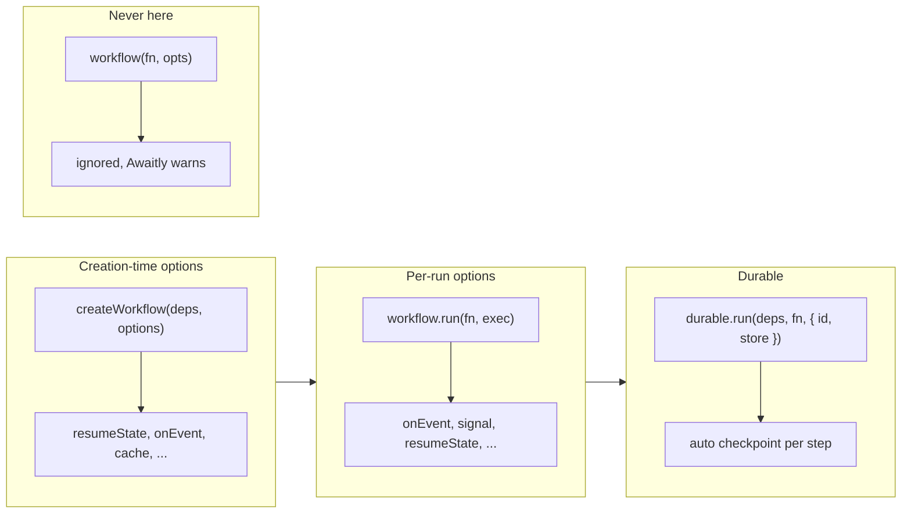

import { Card, CardGrid, Aside } from '@astrojs/starlight/components';

Welcome to the Foundations section. This structured learning path takes you from Result types to production-ready workflows.

<Aside type="tip" title="Prerequisites">
Make sure you've completed [Installation](getting-started/installation/) before diving in.
</Aside>

## Learning Path

Work through these topics in order. Each builds on concepts from the previous one.

<CardGrid>
  <Card title="Result Types" icon="seti:typescript">
    The foundation of typed error handling. Learn `ok()`, `err()`, and transformers.

    [Start here →](foundations/result-types/)
  </Card>
  <Card title="Workflows and Steps" icon="rocket">
    Compose operations with `run()` and `createWorkflow()`. Master the `step()` function.

    [Learn workflows →](foundations/workflows-and-steps/)
  </Card>
  <Card title="Control Flow" icon="random">
    Sequential, parallel, and race patterns. Run operations concurrently.

    [Control flow →](foundations/control-flow/)
  </Card>
  <Card title="Errors and Retries" icon="warning">
    Error inference, TaggedError, and resilience with retries and timeouts.

    [Handle errors →](foundations/error-handling/)
  </Card>
  <Card title="State and Resumption" icon="document">
    Persist workflow state. Resume after crashes. Enable caching.

    [Manage state →](foundations/state-and-resumption/)
  </Card>
  <Card title="Streaming" icon="forward-slash">
    Real-time data streaming. AI token streaming. Transform streams.

    [Stream data →](foundations/streaming/)
  </Card>
</CardGrid>

## What You'll Learn

By the end of this section, you'll understand:

- **Type-safe error handling** - No more `catch (error: unknown)`
- **Workflow composition** - Chain operations that can fail
- **Automatic error inference** - TypeScript computes your error union
- **Resilience patterns** - Retries, timeouts, and backoff strategies
- **State persistence** - Save and resume workflows across restarts
- **Real-time streaming** - Stream tokens, progress, and live updates

## Concepts at a glance

Where workflows, runs, and options live:

- **Creation-time**: Pass options to `createWorkflow(deps, options)`. They apply to every run.
- **Per-run**: Pass options to `workflow.run(fn, exec)` (or `workflow.run(args, fn, exec)`). They apply only to that invocation.
- **Never**: `workflow(fn, opts)` ignores the extra object; Awaitly warns and points you to `.run(...)` or `createWorkflow`.
- **Durable**: `durable.run(...)` wraps a workflow with a store and checkpoints after each keyed step.

## Quick Reference

| Concept | What it does |
|---------|-------------|
| `ok(value)` | Create a success Result |
| `err(error)` | Create a failure Result |
| `step(fn)` | Execute operation, exit early on error |
| `createWorkflow(deps)` | Create reusable workflow with error inference |
| `allAsync([...])` | Run operations in parallel (fail-fast) |
| `step.retry(fn, opts)` | Retry with backoff on failure |
| `resumeState` | Continue from saved checkpoint |

## Next Steps

Start with [Result Types](foundations/result-types/) to learn the core building block of awaitly.
