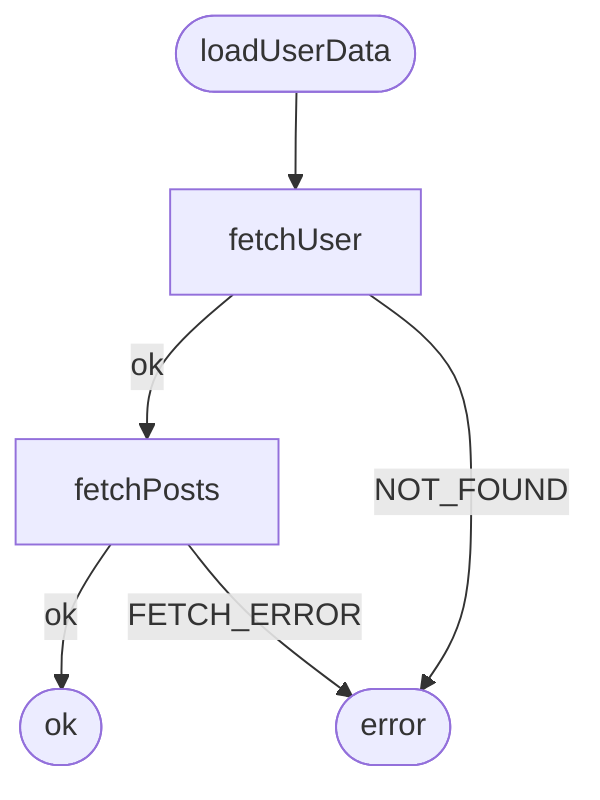

:::note
This page assumes you've read [The Basics](getting-started/basics/): Result types and `run(deps, fn)`.
:::

`createWorkflow()` is `run()` with a name attached. Same deps-first idea, same
unwrapping, same inferred error union, but because the workflow has a name and a
fixed set of deps, awaitly can also test it, retry it, persist it, and **draw it**.

## Define your operations

Nothing new here, operations return `AsyncResult<T, E>`:

```typescript
import { ok, err, type AsyncResult } from 'awaitly';

type User = { id: string; name: string };
type Post = { id: number; title: string };

const fetchUser = async (id: string): AsyncResult<User, 'NOT_FOUND'> =>
  id === '1' ? ok({ id: '1', name: 'Alice' }) : err('NOT_FOUND');

const fetchPosts = async (userId: string): AsyncResult<Post[], 'FETCH_ERROR'> =>
  ok([{ id: 1, title: 'Hello World' }]);
```

## Name it and pass the deps

```typescript
import { createWorkflow } from 'awaitly';

const loadUserData = createWorkflow('loadUserData', { fetchUser, fetchPosts });
```

The first argument is the **workflow name**. It is not decoration. It's the
identifier used in diagrams, traces, persisted state, and analyzer output.

## Run it

The callback receives `{ steps }`, the same bound object `run()` gave you:

```typescript
const result = await loadUserData.run(async ({ steps }) => {
  const user = await steps.fetchUser('1');
  const posts = await steps.fetchPosts(user.id);
  return { user, posts };
});
```

If `fetchUser` returns `err('NOT_FOUND')`, the callback stops there and `result.error`
is `'NOT_FOUND'`. Identical to `run()`.

## Handle the result

```typescript
if (result.ok) {
  console.log(result.value.user.name, result.value.posts.length);
} else {
  switch (result.error) {
    case 'NOT_FOUND':   console.log('User not found'); break;
    case 'FETCH_ERROR': console.log('Failed to fetch posts'); break;
    default:            console.log('Threw:', result.error.cause);
  }
}
```

`result.error` is `'NOT_FOUND' | 'FETCH_ERROR' | UnexpectedError`, inferred from the
deps. See [What TypeScript gives you back](getting-started/types/).

## What you unlocked

Because the workflow is named, this now works:

```bash
npx awaitly-analyze ./src/load-user-data.ts
```



The diagram is generated from your source. No annotations, no separate spec file.
Add a step and the diagram changes; delete one and it disappears. Add
`--assert-diagrammable` in CI and a workflow that drifts out of shape fails the build.

That is the reason to name workflows, and the reason to prefer `steps.fetchUser(id)`
over hand-written control flow. See [Static Analysis](guides/static-analysis/).

:::caution
`run()` works with the analyzer too, but an anonymous `run()` shows up as
`run@file.ts:12` because there's no name to use. Reach for `createWorkflow()` as
soon as you care about the diagram.
:::

## When to use which

| You want | Use |
|----------|-----|
| Compose a few operations, once | `run(deps, fn)` |
| A named unit that appears in diagrams | `createWorkflow(name, deps)` |
| Swap deps in tests | `createWorkflow(name, deps)` |
| Retries, timeouts, caching | `createWorkflow(name, deps)` |
| Resume after a crash | `createWorkflow(name, deps)` |

Both infer the error union from deps. The difference is what you can do afterwards.

## Complete example

```typescript
import { ok, err, type AsyncResult, createWorkflow } from 'awaitly';

type User = { id: string; name: string };
type Post = { id: number; title: string };

const fetchUser = async (id: string): AsyncResult<User, 'NOT_FOUND'> =>
  id === '1' ? ok({ id: '1', name: 'Alice' }) : err('NOT_FOUND');

const fetchPosts = async (userId: string): AsyncResult<Post[], 'FETCH_ERROR'> =>
  ok([{ id: 1, title: 'Hello World' }]);

const loadUserData = createWorkflow('loadUserData', { fetchUser, fetchPosts });

const result = await loadUserData.run(async ({ steps }) => {
  const user = await steps.fetchUser('1');
  const posts = await steps.fetchPosts(user.id);
  return { user, posts };
});

if (result.ok) {
  console.log(`${result.value.user.name} has ${result.value.posts.length} posts`);
}
```

## Next

[What TypeScript gives you back →](getting-started/types/)
