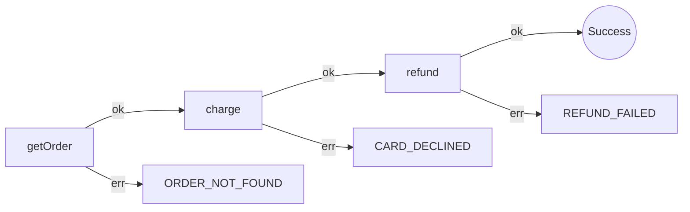

import { Aside, Steps, Tabs, TabItem } from '@astrojs/starlight/components';

A pull request can change the shape of a workflow: you add a step, drop a retry, or let a new error type reach the caller. The text diff shows lines. The action shows the shape on the PR, next to the code.

It runs on your runner with `npx`, so you install no app and create no account.

## What you get on every PR

One comment, updated in place on every push:

- **Merge risk**: 🟢 Low, 🟡 Moderate or 🔴 High, with the reason in one line.
- **Walkthrough**: a table of every workflow the PR changed, with steps, error types and complexity before and after.
- **Checks**: structural regressions, new doctor findings, new error types, complexity.
- **Railway diagram** for each changed workflow. GitHub renders it, open by default.
- **Diff of steps** under each diagram: `+ refund`, `- getUser`.
- **Prompt for AI agents**: every regression and finding with file and line, ready to paste into a coding agent.

The job summary carries the same report, and the *Files changed* tab gets a `::warning` annotation on each new finding.

````markdown
## awaitly review

**Merge risk:** 🔴 High · 1 structural regression, 1 new doctor warning

| File | Workflow | Change | Steps | Errors | Complexity |
|---|---|---|---|---|---|
| `src/orders.ts` | `payOrder` | +1 steps, −1 steps, `conditional` added | 3 | 4 | 1 → 2 |

### 🚥 Checks

| Check | Result | Details |
|---|---|---|
| Structural regressions | ❌ | `payOrder`: step `getUser` removed |
| New doctor findings | ⚠️ | ⚠️ `src/orders.ts:11` unlabelled-conditional: Conditional containing steps should use step.if() for stable IDs |
| New error types | ✅ | none |
| Complexity | ✅ | within thresholds |



```diff
- getUser
+ refund
```
````

<Aside type="tip" title="Regressions are removals">
A regression is something the base had and the head lacks: a removed step, a removed `parallel`, `race` or conditional block, or a whole workflow. Additions never fail the check, so an accidental deletion stands out.
</Aside>

## Install

<Steps>

1. Create `.github/workflows/awaitly-review.yml` in your repository:

   ```yaml title=".github/workflows/awaitly-review.yml"
   name: awaitly review

   on:
     pull_request:

   permissions:
     contents: read
     pull-requests: write

   jobs:
     review:
       runs-on: ubuntu-latest
       steps:
         - uses: actions/checkout@v4
         - uses: actions/setup-node@v4
           with:
             node-version: 22
         - uses: jagreehal/awaitly@analyze-v0
           with:
             path: src
   ```

2. Commit it to your default branch.

3. Open a pull request that touches a workflow. The **awaitly review** check runs and posts the comment.

</Steps>

The action fetches the current 0.x `awaitly-analyze` release through `npx` on the runner. Your repository gains no dependency.

### Requirements

- **Node 22 or newer** on the runner. Add `actions/setup-node` as above; the action stops with a message otherwise.
- **`pull-requests: write`** permission for the comment. Without it the review still writes the job summary and annotations.
- Workflow files that import from `awaitly`. The review skips a file with no awaitly import.

<Aside type="note" title="Pull requests from forks">
GitHub gives a fork's `pull_request` job a read-only token, so the action can't post the comment. The job summary and annotations still work. To comment on fork PRs, trigger on `pull_request_target` and check out the PR head yourself. Read GitHub's guidance on that event first: it runs with write access against untrusted code.
</Aside>

## Configure

Every input has a working default.

| Input | Default | What it does |
|---|---|---|
| `path` | *(whole change)* | Git pathspecs to review, space separated: `src packages/api` |
| `base` | PR base, or the previous commit on `push` | Ref the change is compared against |
| `head` | PR head, or `HEAD` | Ref holding the change |
| `comment` | `true` | Post and keep updating the sticky PR comment |
| `annotations` | `true` | Emit `::warning` / `::error` annotations for new findings |
| `fail-on-regression` | `false` | Fail the job when merge risk is **high** |
| `include-tests` | `false` | Also review `*.test.ts` / `*.spec.ts` files |
| `diagrams` | `open` | Railway diagrams in the comment: `open` or `collapsed` |
| `cli` | `npx -y -p awaitly-analyze@0 awaitly-analyze` | Command that runs the analyzer |
| `github-token` | `github.token` | Token used to post the comment |

Outputs: `risk` (`low` \| `moderate` \| `high`) and `report` (path of the markdown file).

### Versions and pinning

`@analyze-v0` follows the latest `awaitly-analyze` 0.x release of the action. For a fixed action, pin a release tag (`@awaitly-analyze@0.32.0`) or a commit SHA.

The default `cli` also follows 0.x. To freeze the analyzer:

```yaml
- uses: jagreehal/awaitly@analyze-v0
  with:
    cli: npx -y -p awaitly-analyze@0.32.0 awaitly-analyze
```

### Use your project's own install

If `awaitly-analyze` is already a dev dependency, run that copy so CI and your editor agree:

<Tabs>
  <TabItem label="pnpm">
    ```yaml
    - uses: pnpm/action-setup@v4
    - run: pnpm install --frozen-lockfile
    - uses: jagreehal/awaitly@analyze-v0
      with:
        cli: pnpm exec awaitly-analyze
    ```
  </TabItem>
  <TabItem label="npm">
    ```yaml
    - run: npm ci
    - uses: jagreehal/awaitly@analyze-v0
      with:
        cli: npx awaitly-analyze
    ```
  </TabItem>
</Tabs>

### Monorepos

Point `path` at the packages that hold workflows:

```yaml
- uses: jagreehal/awaitly@analyze-v0
  with:
    path: packages/api/src packages/workers/src
```

The review reads files from source text, so you don't need to build the workspace first.

### Make it a required check

Turn on the gate, then add **awaitly review** to the branch protection rules for your default branch:

```yaml
- uses: jagreehal/awaitly@analyze-v0
  with:
    path: src
    fail-on-regression: true
```

The job fails only on **high** risk: a structural regression or a new doctor *error*. Warnings and complexity show in the report without blocking.

To decide for yourself, branch on the output:

```yaml
- uses: jagreehal/awaitly@analyze-v0
  id: awaitly
  with:
    path: src
- if: steps.awaitly.outputs.risk != 'low'
  run: echo "::notice::awaitly risk is ${{ steps.awaitly.outputs.risk }}, ask for a second reviewer"
```

### Summary only

Set `comment: false` to keep the report in the job summary and out of the PR thread.

### Run on push

On `push` the action compares against the previous commit and writes the report to the job summary:

```yaml
on:
  pull_request:
  push:
    branches: [main]
```

## How merge risk is scored

| Risk | When |
|---|---|
| 🔴 **High** | A structural regression, or a new doctor finding with severity `error` |
| 🟡 **Moderate** | A new doctor `warning`, or a workflow whose cyclomatic complexity rose past the warning threshold (10) |
| 🟢 **Low** | Everything else, including any number of additions |

The review runs the doctor on both sides of each file and reports only findings the change introduced. A finding that moved lines stays out of the report.

## Use it locally

The action wraps one CLI command, so you can see the review before you push:

```bash
# What did my branch change, against main?
npx awaitly-analyze review --base origin/main src/

# What did I change since the last commit? (working tree vs HEAD, untracked files included)
npx awaitly-analyze review

# Machine-readable, exit 1 on high risk
npx awaitly-analyze review --base main --head HEAD --format json --fail-on-regression
```

| Flag | Description |
|---|---|
| `[PATHSPEC...]` | Git pathspecs restricting the change set |
| `--base <ref>` | Ref to compare against (default: `HEAD`) |
| `--head <ref>` | Ref holding the change (default: the working tree) |
| `--format markdown\|json` | JSON carries `files`, `regressions`, `newFindings`, `risk` and the rendered `markdown` |
| `-o, --output <file>` | Write the report to a file |
| `--fail-on-regression` | Exit 1 when merge risk is high |
| `--include-tests` | Also review `*.test.ts` / `*.spec.ts` files |
| `--diagrams <mode>` | Railway diagrams `open` (default) or `collapsed` |

The markdown starts with `<!-- awaitly-analyze-review -->`, which the action uses to find and update its own comment. A bot for GitLab or Gitea can do the same with one `--format json` run.

## Troubleshooting

**"No awaitly workflows changed."** The PR touched no `.ts`/`.tsx` file with an awaitly workflow under `path`. The review skips test files (`*.test.ts`, `*.spec.ts`) and `.d.ts` files unless you set `include-tests`.

**The job is green but no comment appears.** Look for a `could not post the review comment` warning in the run. Check that the job has `pull-requests: write` and that the PR doesn't come from a fork. The job summary still holds the report.

**"awaitly-analyze needs Node 22+".** Add `actions/setup-node@v4` with `node-version: 22` before the action.

**"Cannot resolve 'x'. Fetch it first".** The checkout lacks the base or head commit. The action fetches both refs; if you pass a custom `base`, use a ref the runner can fetch from `origin`.

**A moved file.** The review follows renames and diffs a renamed file against its old path; the walkthrough shows `old → new`. If git misses the rename because the file changed too much, review that file by hand.

## Related

- [Static Analysis](guides/static-analysis/): the analyzer, `--diff` and `--doctor` behind the review
- [Visualization](guides/visualization/): railway and flowchart diagrams
