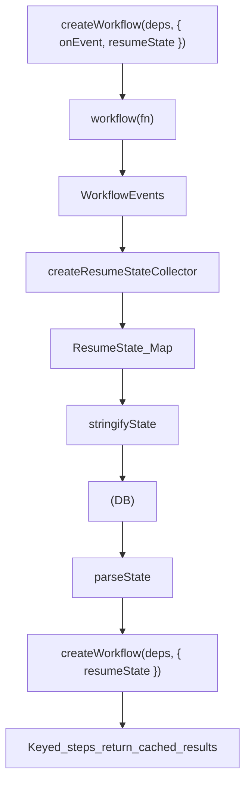

## Where options go (creation vs per-run)

There are **three** places you might try to pass “options”. Only two are real.

- **Creation-time (sticky)**: `createWorkflow(deps, options)`
- **Per-run (one invocation)**: `workflow.run(fn, exec)` (or `workflow.run(args, fn, exec)`)
- **Never**: `workflow(fn, exec)` or `workflow(args, fn, exec)` (those extra objects are ignored; Awaitly will warn)

See also: [Concepts at a glance](/foundations/#concepts-at-a-glance) (workflow vs run vs durable, where options live). For the full restart story (crash recovery, list pending, resume by id), see [Crash recovery and queue worker pattern](./durable-execution#crash-recovery-and-queue-worker-pattern) in the durable execution guide.

## Mental model (manual persistence)



:::caution[Options go to createWorkflow]
Options like `resumeState` must be passed to `createWorkflow(deps, { resumeState })`, not when calling the workflow. Options passed to the executor are ignored (Awaitly will warn and point you to `workflow.run(...)` or `createWorkflow(deps, options)`).
:::

Save workflow state to a database and resume later. Completed steps return their cached results without re-executing.

## Quick Start Imports

**Option 1: Import from main package** (recommended for most use cases)

```typescript
import { createWorkflow, createResumeStateCollector, isStepComplete } from 'awaitly/workflow';
import { stringifyState, parseState } from 'awaitly/persistence';
```

**Option 2: Import from persistence submodule** (for full persistence API)

```typescript
import { createWorkflow, createResumeStateCollector, isStepComplete } from 'awaitly/workflow';
import { stringifyState, parseState, createStatePersistence } from 'awaitly/persistence';
```

:::danger[Always use stringifyState/parseState]
`ResumeState.steps` is a `Map`, which **cannot be serialized with `JSON.stringify()`**. Maps become empty objects `{}` when serialized directly!

```typescript
// WRONG - Map becomes empty object!
const json = JSON.stringify(state);
const restored = JSON.parse(json);  // steps is {} not Map!
```

```typescript
// CORRECT - preserves Map structure
import { stringifyState, parseState } from 'awaitly/persistence';
const json = stringifyState(state);
const restored = parseState(json);  // steps is Map!
```

:::

## Collect state during execution

Use `createResumeStateCollector` to automatically capture step results:

```typescript
import { createWorkflow, createResumeStateCollector } from 'awaitly/workflow';

const collector = createResumeStateCollector();

const workflow = createWorkflow(
  { fetchUser, fetchPosts },
  { onEvent: collector.handleEvent }
);

await workflow(async (step) => {
  const user = await step(() => fetchUser('1'), { key: 'user:1' });
  const posts = await step(() => fetchPosts(user.id), { key: `posts:${user.id}` });
  return { user, posts };
});

// Get collected state
const state = collector.getResumeState();
```

Only steps with `key` are saved.

## Save to database

Serialize the state and store it:

```typescript
import { stringifyState } from 'awaitly/persistence';

const json = stringifyState(state, {
  workflowId: 'wf-123',
  timestamp: Date.now(),
});

await db.workflowStates.create({
  id: 'wf-123',
  state: json,
  createdAt: new Date(),
});
```

## Resume from saved state

Load and parse the state, then pass it to a new workflow:

```typescript
import { parseState } from 'awaitly/persistence';

const saved = await db.workflowStates.findUnique({
  where: { id: 'wf-123' },
});

const resumeState = parseState(saved.state);

const workflow = createWorkflow(
  { fetchUser, fetchPosts },
  { resumeState }
);

await workflow(async (step) => {
  // These steps return cached values - no actual fetch
  const user = await step(() => fetchUser('1'), { key: 'user:1' });
  const posts = await step(() => fetchPosts(user.id), { key: `posts:${user.id}` });
  return { user, posts };
});
```

## State persistence adapter

For structured storage, use `createStatePersistence` with a `KeyValueStore` implementation:

```typescript
import { createStatePersistence } from 'awaitly/persistence';

const persistence = createStatePersistence({
  get: (key) => redis.get(key),
  set: (key, value) => redis.set(key, value),
  delete: (key) => redis.del(key).then(n => n > 0),
  exists: (key) => redis.exists(key).then(n => n > 0),
  keys: (pattern) => redis.keys(pattern),
}, 'workflow:state:');

// Save
await persistence.save('wf-123', state, { userId: 'user-1' });

// Load
const savedState = await persistence.load('wf-123');

// Resume
const workflow = createWorkflow(deps, { resumeState: savedState });
```

## Creating Custom Persistence Adapters

You can create your own persistence adapter by implementing the `KeyValueStore` interface. The official `awaitly-postgres` and `awaitly-mongo` packages are great examples of how to build production-ready adapters.

### The KeyValueStore Interface

All persistence adapters must implement this interface:

```typescript
import type { KeyValueStore } from 'awaitly/persistence';

interface KeyValueStore {
  get(key: string): Promise<string | null>;
  set(key: string, value: string, options?: { ttl?: number }): Promise<void>;
  delete(key: string): Promise<boolean>;
  exists(key: string): Promise<boolean>;
  keys(pattern: string): Promise<string[]>;
}
```

For implementation examples, see the source code of the official adapters:

- [awaitly-postgres](https://github.com/jagreehal/awaitly/tree/main/packages/awaitly-postgres)
- [awaitly-mongo](https://github.com/jagreehal/awaitly/tree/main/packages/awaitly-mongo)

## Official Persistence Adapters

For production use, consider using the official persistence adapters:

### PostgreSQL

The [`awaitly-postgres`](https://www.npmjs.com/package/awaitly-postgres) package ([source](https://github.com/jagreehal/awaitly/tree/main/packages/awaitly-postgres)) provides a ready-to-use PostgreSQL adapter:

```typescript
import { createPostgresPersistence } from 'awaitly-postgres';

const store = await createPostgresPersistence({
  connectionString: process.env.DATABASE_URL,
});
```

[Learn more about PostgreSQL persistence →](./postgres-persistence/)

### MongoDB

The [`awaitly-mongo`](https://www.npmjs.com/package/awaitly-mongo) package ([source](https://github.com/jagreehal/awaitly/tree/main/packages/awaitly-mongo)) provides a ready-to-use MongoDB adapter:

```typescript
import { createMongoPersistence } from 'awaitly-mongo';

const store = await createMongoPersistence({
  connectionString: process.env.MONGODB_URI,
});
```

[Learn more about MongoDB persistence →](./mongo-persistence/)

## Check if step is complete

Use `isStepComplete` to check state before execution:

```typescript
import { isStepComplete } from 'awaitly/workflow';

const state = await persistence.load('wf-123');

if (isStepComplete(state, 'user:1')) {
  console.log('User already fetched');
}
```

## Crash recovery pattern

Save state after each batch of work:

```typescript
const collector = createResumeStateCollector();
const workflow = createWorkflow(deps, { onEvent: collector.handleEvent });

const result = await workflow(async (step) => {
  const user = await step(() => fetchUser('1'), { key: 'user:1' });

  // Save after critical step
  await saveCheckpoint(collector.getResumeState());

  const posts = await step(() => fetchPosts(user.id), { key: `posts:${user.id}` });
  return { user, posts };
});

// Final save
await saveCheckpoint(collector.getResumeState());
```

If the workflow crashes, resume from the last checkpoint:

```typescript
const savedState = await loadCheckpoint('wf-123');

const workflow = createWorkflow(deps, { resumeState: savedState });

// Completed steps use cached values
await workflow(async (step) => {
  const user = await step(() => fetchUser('1'), { key: 'user:1' });
  const posts = await step(() => fetchPosts(user.id), { key: `posts:${user.id}` });
  return { user, posts };
});
```

## Async resume state loading

Load state lazily:

```typescript
import { parseState } from 'awaitly/persistence';

const workflow = createWorkflow(deps, {
  resumeState: async () => {
    const saved = await db.workflowStates.findUnique({ where: { id: 'wf-123' } });
    return saved ? parseState(saved.state) : undefined;
  },
});
```

## File-based persistence

For simple cases, use the file cache adapter:

```typescript
import { createFileCache } from 'awaitly/persistence';

const cache = createFileCache({
  directory: './workflow-state',
  ttlMs: 7 * 24 * 60 * 60 * 1000, // 7 days
});

const workflow = createWorkflow(deps, { cache });
```

## Next

[Learn about Human-in-the-Loop →](/guides/human-in-loop/)
