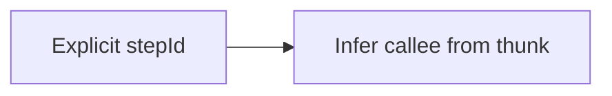

Analyze workflow source code to extract structure, dependencies, and generate visualization data without executing the workflow.

**Documentation fields:** `description` and `markdown` on workflows and steps are the canonical way to feed static analysis and doc generation. See [Documenting workflows](/docs/guides/documenting-workflows/) for how to set them. JSDoc above workflow and step declarations is also extracted and available as `jsdocDescription` on the root and step nodes.

**Step names:** The analyzer resolves the step **display name** (for docs/diagrams) as:



- **Explicit stepId** — `step('name', fn, opts)` → use that string as name.
- **Infer from thunk** — legacy form `step(fn, opts)` → parse the thunk and use the callee (e.g. `fetchUser`, `deps.fetchUser`) as name. The analyzer does not use `opts.key` as the display name (key is for caching only).

**Runtime** uses the same order: explicit id → infer from thunk → fallback. Key is not used for the step id (key is for caching only).

So `step('fetchUser', () => fetchUser('1'))` and `step(() => fetchUser('1'))` often show the same label in generated docs and in events. See [Steps: how step ID is determined](/docs/foundations/step/#basic-usage) for the full runtime flow diagram.

## CLI Tool

The `awaitly-analyze` CLI analyzes TypeScript workflow files and outputs Mermaid diagrams or JSON:

```bash
# Output Mermaid diagram (default)
npx awaitly-analyze ./src/workflows/checkout.ts

# Output JSON
npx awaitly-analyze ./src/workflows/checkout.ts --format=json

# Pipe to file
npx awaitly-analyze ./src/workflows/checkout.ts > workflow.md

# Show step cache keys
npx awaitly-analyze ./src/workflows/checkout.ts --keys

# Change diagram direction (TB, LR, BT, RL)
npx awaitly-analyze ./src/workflows/checkout.ts --direction=LR
```

### Multi-workflow output

When a file contains multiple workflows, each gets its own section with a markdown header and mermaid diagram:

```text
## Workflow: checkoutWorkflow

(mermaid diagram for checkout workflow)

## Workflow: paymentWorkflow

(mermaid diagram for payment workflow)
```

## Basic usage

```typescript
import { analyze } from 'awaitly-analyze';

// Analyze a single-workflow file
const ir = analyze('./src/workflows/checkout.ts').single();
console.log(`Steps: ${ir.metadata.stats.totalSteps}`);

// Analyze a multi-workflow file
const workflows = analyze('./src/workflows/all.ts').all();
for (const ir of workflows) {
  console.log(`${ir.root.workflowName}: ${ir.metadata.stats.totalSteps} steps`);
}

// Get a specific workflow by name
const checkout = analyze('./src/workflows/all.ts').named('checkoutWorkflow');
```

### Fluent API methods

| Method | Returns | Throws | Use when |
|--------|---------|--------|----------|
| `.single()` | Single IR | If 0 or >1 workflows | File has exactly one workflow |
| `.singleOrNull()` | IR or null | Never | Checking if file has one workflow |
| `.all()` | IR array | Never | Processing all workflows in file |
| `.named(name)` | Single IR | If not found | Targeting specific workflow by name |
| `.first()` | Single IR | If empty | Getting first workflow, don't care about count |
| `.firstOrNull()` | IR or null | Never | Safely getting first workflow |

**Choosing the right method:**

```typescript
// Most common: single workflow per file
const ir = analyze('./checkout.ts').single();

// Multi-workflow files: iterate all
for (const ir of analyze('./workflows.ts').all()) {
  console.log(ir.root.workflowName);
}

// Target by name when you know what you want
const payment = analyze('./workflows.ts').named('paymentWorkflow');

// Safe access when file might be empty
const ir = analyze(filePath).firstOrNull();
if (ir) {
  // process workflow
}
```

## Analyzing source strings

Analyze workflow code directly without reading from a file:

```typescript
import { analyze } from 'awaitly-analyze';

const source = `
  const checkout = createWorkflow(deps);

  async function run() {
    return await checkout(async (step) => {
      const cart = await step(() => deps.fetchCart(), { key: 'cart' });
      const total = await step(() => deps.calculateTotal(cart), { key: 'total' });
      return { cart, total };
    });
  }
`;

const ir = analyze.source(source).single();
console.log(ir.metadata.stats);
// { totalSteps: 2, conditionalCount: 0, parallelCount: 0, ... }
```

## What gets detected

The analyzer extracts:

| Feature | Detection |
|---------|-----------|
| Steps | `step()`, `step.retry()`, `step.withTimeout()` |
| Conditionals | `if/else`, `when()`, `unless()`, `whenOr()`, `unlessOr()` |
| Loops | `for`, `while`, `for-of`, `for-in` |
| Parallel | `step.parallel()`, `allAsync()`, `allSettledAsync()` |
| Race | `step.race()`, `anyAsync()` |
| Retry/Timeout | Options in step config, `step.retry()`, `step.withTimeout()` |
| Workflow refs | Calls to other workflows |

### Supported callback patterns

The analyzer handles various callback patterns:

```typescript
// Simple identifier
workflow(async (step) => { ... });

// Destructuring
workflow(async ({ step }) => { ... });

// Destructuring with alias
workflow(async ({ step: runStep }) => { ... });

// Destructuring with default
workflow(async ({ step = defaultStep }) => { ... });

// Destructuring with alias and default
workflow(async ({ step: runStep = fallback }) => { ... });
```

## IR structure

The analyzer returns a `StaticWorkflowIR` with:

```typescript
interface StaticWorkflowIR {
  root: StaticWorkflowNode;      // Workflow tree
  metadata: StaticAnalysisMetadata;
  references: Map<string, StaticWorkflowIR>;
}

interface StaticAnalysisMetadata {
  analyzedAt: number;
  filePath: string;
  warnings: AnalysisWarning[];
  stats: AnalysisStats;
}

interface AnalysisStats {
  totalSteps: number;
  conditionalCount: number;
  parallelCount: number;
  raceCount: number;
  loopCount: number;
  workflowRefCount: number;
  unknownCount: number;
}
```

## Node types

The workflow tree contains these node types:

```typescript
type StaticFlowNode =
  | StaticStepNode        // step() call
  | StaticSequenceNode    // Sequential steps
  | StaticParallelNode    // Parallel execution
  | StaticRaceNode        // Race execution
  | StaticConditionalNode // if/else or conditional helpers
  | StaticLoopNode        // for/while loops
  | StaticWorkflowRefNode // Call to another workflow
  | StaticUnknownNode;    // Unanalyzable code
```

## API types reference

Main static-analysis node types and when fields are populated:

- **StaticWorkflowNode** (root): `workflowName`, `source`, `dependencies`, `children`, `description`, `markdown`, `jsdocDescription?`, `errorTypes`.
  `description` and `markdown` are set only for `createWorkflow` / `createSagaWorkflow` (from options or deps). They are undefined for `run()` / `runSaga()`. `jsdocDescription` is extracted from JSDoc above the workflow variable when present.

- **StaticStepNode**: `stepId?`, `callee`, `name`, `key`, `description`, `markdown`, `jsdocDescription?`, `retry`, `timeout`, `errors?`, `out?`, `reads?`.
  `stepId` is set when you use **`step('id', fn, opts)`** (string literal first argument); use this form for best results in generated docs and diagrams. `description` and `markdown` come from step options. `jsdocDescription` is extracted from JSDoc above the step statement.

- **StaticSagaStepNode**: `callee`, `name`, `description`, `markdown`, `jsdocDescription?`, `hasCompensation`, `compensationCallee`, `isTryStep`.
  `description` and `markdown` come from saga step options.

- **DependencyInfo**: `name`, `typeSignature?`, `errorTypes`.
  `typeSignature` is the TypeScript type when the type checker is available. `errorTypes` is not yet inferred from types.

## Walking the tree

Use the built-in helpers to traverse nodes:

```typescript
import {
  analyze,
  isStaticStepNode,
  isStaticConditionalNode,
  getStaticChildren
} from 'awaitly-analyze';

function walkWorkflow(node: StaticFlowNode) {
  if (isStaticStepNode(node)) {
    console.log(`Step: ${node.key || node.name}`);
  }

  if (isStaticConditionalNode(node)) {
    console.log(`Condition: ${node.condition}`);
  }

  // Recursively walk children
  for (const child of getStaticChildren(node)) {
    walkWorkflow(child);
  }
}

const ir = analyze('./checkout.ts').single();
for (const child of ir.root.children) {
  walkWorkflow(child);
}
```

## Multiple workflows

A single file can contain multiple workflows:

```typescript
import { analyze } from 'awaitly-analyze';

const source = `
  const workflowA = createWorkflow(depsA);
  const workflowB = createWorkflow(depsB);

  async function runA() {
    return await workflowA(async (step) => { ... });
  }

  async function runB() {
    return await workflowB(async (step) => { ... });
  }
`;

const result = analyze.source(source);

// Get all workflows
const workflows = result.all();
console.log(workflows.length); // 2

// Get by name
const wfA = analyze.source(source).named('workflowA');
const wfB = analyze.source(source).named('workflowB');
```

## Use cases

### Generating documentation

Use `description` and `markdown` on workflows and steps (see [Documenting workflows](/docs/guides/documenting-workflows/)) so the analyzer can extract them. Then:

1. Call `analyze(filePath).all()` to get all workflows in a file.
2. For each IR: use `root.workflowName`, `root.description`, `root.markdown` for the workflow title and body.
3. Walk `root.children` (and nested sequences) to list steps; use each step’s `name`, `key`, `description`, `markdown` for step tables or lists.
4. Optionally use `generatePaths(ir)` and `renderStaticMermaid(ir)` for path coverage and diagrams.

Minimal recipe:

```typescript
import { analyze, getStaticChildren, isStaticStepNode } from 'awaitly-analyze';

const workflows = analyze('./src/workflows/checkout.ts').all();

for (const ir of workflows) {
  const { root } = ir;
  console.log(`# ${root.workflowName}\n`);
  if (root.description) console.log(root.description + '\n');
  if (root.markdown) console.log(root.markdown + '\n');
  console.log(`- ${ir.metadata.stats.totalSteps} steps\n`);

  function listSteps(node) {
    if (isStaticStepNode(node)) {
      const name = node.stepId ?? node.name ?? node.key ?? 'step';
      console.log(`- **${name}**${node.description ? ` — ${node.description}` : ''}`);
    }
    for (const child of getStaticChildren(node)) listSteps(child);
  }
  for (const child of root.children) listSteps(child);
}
```

An optional script that does this is provided in the repo: run `node packages/awaitly-analyze/scripts/generate-workflow-docs.mjs <path-to-workflow.ts>` from the repo root (after building awaitly-analyze) to output one markdown section per workflow.

### Build test coverage matrix

```typescript
import { analyze, isStaticConditionalNode } from 'awaitly-analyze';

function countPaths(node: StaticFlowNode): number {
  if (isStaticConditionalNode(node)) {
    const thenPaths = node.consequent.reduce((n, c) => n * countPaths(c), 1);
    const elsePaths = (node.alternate || []).reduce((n, c) => n * countPaths(c), 1);
    return thenPaths + elsePaths;
  }
  // ... handle other node types
  return 1;
}

const ir = analyze('./checkout.ts').single();
console.log(`Execution paths: ${countPaths(ir.root)}`);
```

### Validate workflow complexity

```typescript
import { analyze } from 'awaitly-analyze';

const ir = analyze('./checkout.ts').single();
const stats = ir.metadata.stats;

if (stats.totalSteps > 20) {
  console.warn('Consider breaking this workflow into smaller pieces');
}

if (stats.conditionalCount > 5) {
  console.warn('High cyclomatic complexity');
}
```

## Renderers

Generate output from the IR using built-in renderers:

### Mermaid renderer

```typescript
import { analyze, renderStaticMermaid } from 'awaitly-analyze';

const ir = analyze('./checkout.ts').single();
const mermaid = renderStaticMermaid(ir, {
  direction: 'TB',      // TB, LR, BT, RL
  showKeys: false,      // Show step cache keys
  showConditions: true, // Show condition text
});

console.log(mermaid);
// flowchart TB
//   start(("▶"))
//   step_1["Fetch cart"]
//   ...
```

### JSON renderer

```typescript
import { analyze, renderStaticJSON, renderMultipleStaticJSON } from 'awaitly-analyze';

const ir = analyze('./checkout.ts').single();
const json = renderStaticJSON(ir, { pretty: true });

// For multiple workflows
const workflows = analyze('./checkout.ts').all();
const multiJson = renderMultipleStaticJSON(workflows, './checkout.ts', {
  pretty: true,
});
```

### JSON output shape

The output of `renderStaticJSON(ir)` has this structure:

- **Top level**: `{ root, metadata?, references? }`
- **StaticWorkflowNode**: `type: "workflow"`, `id`, `workflowName`, `source?`, `dependencies[]`, `errorTypes[]`, `children[]`, `description?`, `markdown?`, `jsdocDescription?`
- **Flow nodes** (discriminated by `type`): `"step"` (includes `stepId?` when using `step('id', fn, opts)`), `"saga-step"`, `"sequence"`, `"parallel"`, `"race"`, `"conditional"`, `"switch"`, `"loop"`, `"stream"`, `"workflow-ref"`, `"unknown"`

A JSON Schema for validation is available at `schema/static-workflow-ir.schema.json` in the awaitly-analyze package.

### Custom names

Parallel and race nodes support custom names that appear in diagrams:

```typescript
// Object form with name option
await step.parallel(
  { user: () => deps.fetchUser(), posts: () => deps.fetchPosts() },
  { name: 'Fetch user data' }
);

// Array form with name
await step.parallel('Fetch all', () => allAsync([
  deps.fetchUser(),
  deps.fetchPosts(),
]));
```

Both forms render with the custom name in Mermaid diagrams instead of generic "Parallel (all)".

## Limitations

- **Dynamic code**: Template literals in step keys show as `<dynamic>`
- **External imports**: Referenced workflows must be in the same file to resolve

## Next

[Learn about Visualization →](/visualization/)
