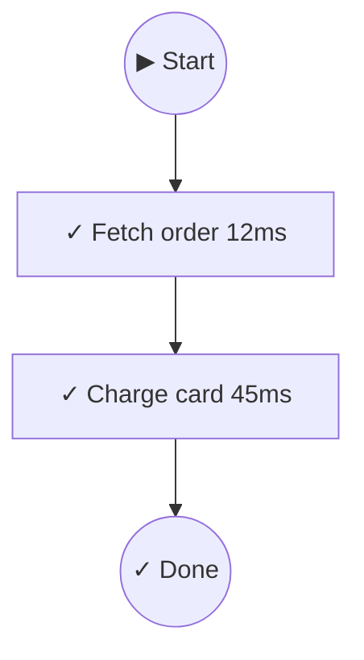

Visualize workflow execution as ASCII diagrams or Mermaid charts for debugging, documentation, or dashboards.

## Basic usage

```typescript
import { createWorkflow, ok, err, type Result } from 'awaitly';
import { createVisualizer } from 'awaitly/visualize';

// Define your dependencies with Result-returning functions
const deps = {
  fetchOrder: async (id: string): Promise<Result<Order, OrderNotFound>> => {
    const order = await db.orders.find(id);
    return order ? ok(order) : err({ type: 'ORDER_NOT_FOUND', id });
  },
  chargeCard: async (amount: number): Promise<Result<Payment, PaymentFailed>> => {
    const result = await paymentGateway.charge(amount);
    return result.success
      ? ok(result.payment)
      : err({ type: 'PAYMENT_FAILED', reason: result.error });
  },
};

const viz = createVisualizer({ workflowName: 'checkout' });

const workflow = createWorkflow(deps, {
  onEvent: viz.handleEvent,
});

await workflow(async (step, deps) => {
  const order = await step(() => deps.fetchOrder('123'), { name: 'Fetch order' });
  const payment = await step(() => deps.chargeCard(order.total), { name: 'Charge card' });
  return { order, payment };
});

// ASCII output
console.log(viz.render());

// Mermaid output
console.log(viz.renderAs('mermaid'));
```

## Migration from manual logging

If you're currently using manual `onEvent` logging, here's how to migrate to `createVisualizer`:

### Before: Manual logging

```typescript
const workflow = createWorkflow(deps, {
  onEvent: (event) => {
    if (event.type === 'step_start') {
      console.log(`Starting: ${event.name}`);
    }
    if (event.type === 'step_complete') {
      console.log(`Completed: ${event.name} in ${event.durationMs}ms`);
    }
    if (event.type === 'step_error') {
      console.error(`Failed: ${event.name}`, event.error);
    }
  },
});
```

### After: Using createVisualizer

```typescript
import { createVisualizer } from 'awaitly/visualize';

const viz = createVisualizer({ workflowName: 'checkout' });
const workflow = createWorkflow(deps, {
  onEvent: viz.handleEvent,
});

// Run workflow...
console.log(viz.render()); // ASCII diagram with all steps
```

### Benefits comparison

| Feature | Manual Logging | createVisualizer |
|---------|---------------|------------------|
| Timing per step | Manual calculation | Automatic |
| Error formatting | Custom | Structured |
| Parallel detection | Not supported | Automatic |
| Output formats | Text only | ASCII, Mermaid, JSON, Flowchart |
| Diagram generation | Not supported | Built-in |
| Post-execution analysis | Manual | Built-in |

## ASCII output

```
┌── checkout ──────────────────────────────────────────────────────┐
│                                                                  │
│  ✓ Fetch order [12ms]                                            │
│  ✓ Charge card [45ms]                                            │
│                                                                  │
│  Completed in 57ms                                               │
│                                                                  │
└──────────────────────────────────────────────────────────────────┘
```

## Mermaid output



Paste into GitHub markdown or any Mermaid-compatible renderer.

## JSON output

Get structured data for custom rendering:

```typescript
const ir = viz.renderAs('json');
// {
//   workflowName: 'checkout',
//   status: 'completed',
//   steps: [...],
//   duration: 57
// }
```

## Naming steps

Give steps descriptive names for better diagrams:

```typescript
const user = await step(() => fetchUser('1'), { name: 'Fetch user' });
const posts = await step(() => fetchPosts(user.id), { name: 'Fetch posts' });
```

Without names, steps show as "unnamed step".

## Parallel operations

Track parallel operations individually:

```typescript
import { allAsync } from 'awaitly';

const result = await workflow(async (step) => {
  const [user, posts] = await step(
    () => allAsync([
      fetchUser('1'),
      fetchPosts('1'),
    ]),
    { name: 'Fetch user data' }
  );
  return { user, posts };
});
```

## Decision tracking

Track conditional logic (if/switch) to visualize branching in your workflows:

### Basic decision tracking

```typescript
import { trackDecision } from 'awaitly/visualize';

const viz = createVisualizer();
const workflow = createWorkflow(deps, {
  onEvent: viz.handleEvent,
});

await workflow(async (step) => {
  const user = await step(() => fetchUser('1'), { name: 'Fetch user' });

  // Track a decision point
  const decision = trackDecision('check-role', {
    condition: "user.role === 'admin'",
    value: user.role,
    emit: viz.handleDecisionEvent,
  });

  if (user.role === 'admin') {
    decision.takeBranch('admin', true);
    await step(() => adminDashboard(user), { name: 'Admin dashboard' });
  } else {
    decision.takeBranch('user', true);
    await step(() => userDashboard(user), { name: 'User dashboard' });
  }

  decision.end();
});
```

### trackIf - Simple if/else

```typescript
import { trackIf } from 'awaitly/visualize';

const decision = trackIf('check-premium', user.isPremium, {
  condition: 'user.isPremium',
  emit: viz.handleDecisionEvent,
});

if (decision.condition) {
  decision.then();
  await step(() => fetchPremiumData(user.id));
} else {
  decision.else();
  await step(() => fetchBasicData(user.id));
}

decision.end();
```

### trackSwitch - Switch statements

```typescript
import { trackSwitch } from 'awaitly/visualize';

const decision = trackSwitch('process-by-role', user.role, {
  condition: 'switch(user.role)',
  emit: viz.handleDecisionEvent,
});

switch (user.role) {
  case 'admin':
    decision.case('admin', true);
    await step(() => processAdmin(user));
    break;
  case 'moderator':
    decision.case('moderator', true);
    await step(() => processModerator(user));
    break;
  default:
    decision.default(true);
    await step(() => processUser(user));
}

decision.end();
```

### With event collector

```typescript
import { createEventCollector, trackIf } from 'awaitly/visualize';

const collector = createEventCollector({ workflowName: 'Role Check' });
const workflow = createWorkflow(deps, {
  onEvent: collector.handleEvent,
});

await workflow(async (step) => {
  const user = await step(() => fetchUser('1'), { name: 'Fetch user' });

  const decision = trackIf('check-role', user.role === 'admin', {
    condition: "user.role === 'admin'",
    value: user.role,
    emit: collector.handleDecisionEvent,
  });

  if (decision.condition) {
    decision.then();
    await step(() => processAdmin(user));
  } else {
    decision.else();
    await step(() => processUser(user));
  }
  decision.end();

  return user;
});

// Visualize with decision tracking
console.log(collector.visualize());
```

## Post-execution visualization

Collect events and visualize later:

```typescript
import { createEventCollector } from 'awaitly/visualize';

const collector = createEventCollector({ workflowName: 'my-workflow' });

const workflow = createWorkflow(deps, {
  onEvent: collector.handleEvent,
});

await workflow(async (step) => { ... });

// Visualize anytime after
console.log(collector.visualize());
console.log(collector.visualizeAs('mermaid'));
```

## Options

```typescript
const viz = createVisualizer({
  workflowName: 'checkout',
  showTimings: true,       // Show step durations (default: true)
  showKeys: false,         // Show step cache keys (default: false)
  detectParallel: true,    // Enable parallel detection (default: true)
});
```

## Convenience APIs

### createVisualizingWorkflow

Create a workflow with built-in visualization in one step:

```typescript
import { createVisualizingWorkflow } from 'awaitly/visualize';

const { workflow, visualizer } = createVisualizingWorkflow(deps, {
  workflowName: 'checkout',
});

await workflow(async (step, deps) => {
  const order = await step(() => deps.fetchOrder('123'), { name: 'Fetch order' });
  const payment = await step(() => deps.chargeCard(order.total), { name: 'Charge card' });
  return { order, payment };
});

console.log(visualizer.render());
```

Forward events to additional handlers:

```typescript
const { workflow, visualizer } = createVisualizingWorkflow(deps, {
  workflowName: 'checkout',
  forwardTo: (event) => metrics.track(event.type, event),
});
```

### combineEventHandlers

Combine multiple event handlers for visualization + logging + metrics:

```typescript
import { createVisualizer, combineEventHandlers } from 'awaitly/visualize';

const viz = createVisualizer({ workflowName: 'checkout' });

const workflow = createWorkflow(deps, {
  onEvent: combineEventHandlers(
    viz.handleEvent,
    (e) => console.log(e.type),
    (e) => metrics.track(e),
  ),
});
```

## When to use each renderer

| Renderer | Best For | Example Use |
|----------|----------|-------------|
| ASCII | Terminal debugging | Quick inspection during development |
| Mermaid | Documentation | GitHub READMEs, Confluence pages |
| Logger | Production | Structured logging with Pino/Winston |
| Flowchart | Complex workflows | Box-and-arrow diagrams in terminal |
| JSON | Custom rendering | Building custom UIs or dashboards |

### ASCII renderer

Best for terminal-based debugging during development:

```typescript
const output = viz.renderAs('ascii');
// ┌── checkout ──────────────────────────────────────────┐
// │  ✓ Fetch order [12ms]                                │
// │  ✓ Charge card [45ms]                                │
// │  Completed in 57ms                                   │
// └──────────────────────────────────────────────────────┘
```

### Mermaid renderer

Best for documentation that renders in GitHub, Confluence, or other Markdown viewers:

```typescript
const mermaid = viz.renderAs('mermaid');
// flowchart TD
//     start(("▶ Start"))
//     step_1[✓ Fetch order 12ms]:::success
//     ...
```

### Logger renderer

Best for production logging with structured output:

```typescript
import { loggerRenderer } from 'awaitly/visualize';

const renderer = loggerRenderer();
const output = renderer.render(viz.getIR(), {
  showTimings: true,
  showKeys: false,
  colors: { success: 'green', error: 'red', ... },
});
```

### Flowchart renderer

Best for complex workflows with box-and-arrow diagrams:

```typescript
const flowchart = viz.renderAs('flowchart');
// ╭──────────────────╮
// │   Fetch order    │
// ╰────────┬─────────╯
//          │
//          ▼
// ╭──────────────────╮
// │   Charge card    │
// ╰──────────────────╯
```

## Integration patterns

### Express middleware

Log and visualize workflows in HTTP handlers:

```typescript
import { createEventCollector } from 'awaitly/visualize';

app.post('/checkout', async (req, res) => {
  const collector = createEventCollector({ workflowName: 'checkout' });

  const workflow = createWorkflow(deps, {
    onEvent: collector.handleEvent,
  });

  const result = await workflow(async (step, deps) => {
    const order = await step(() => deps.fetchOrder(req.body.orderId), { name: 'Fetch order' });
    const payment = await step(() => deps.chargeCard(order.total), { name: 'Charge card' });
    return { order, payment };
  });

  // Log visualization on error for debugging
  if (!result.ok) {
    logger.error('Checkout failed', {
      visualization: collector.visualize(),
      events: collector.getEvents(),
    });
    return res.status(500).json({ error: result.error });
  }

  res.json(result.value);
});
```

### Event collector for batched logging

Collect events across multiple workflow runs for aggregated analysis:

```typescript
import { createEventCollector, visualizeEvents } from 'awaitly/visualize';

const allEvents: CollectableEvent[] = [];

const workflow = createWorkflow(deps, {
  onEvent: (e) => allEvents.push(e),
});

// Run multiple workflows
await workflow(async (step) => { ... });
await workflow(async (step) => { ... });

// Visualize all events together
console.log(visualizeEvents(allEvents, { workflowName: 'batch-run' }));
```

### CI/CD artifact generation

Generate Mermaid diagrams as build artifacts:

```typescript
import fs from 'fs';
import { createVisualizingWorkflow } from 'awaitly/visualize';

const { workflow, visualizer } = createVisualizingWorkflow(deps, {
  workflowName: 'deployment',
});

await workflow(async (step, deps) => {
  await step(() => deps.runTests(), { name: 'Run tests' });
  await step(() => deps.buildApp(), { name: 'Build app' });
  await step(() => deps.deploy(), { name: 'Deploy' });
});

// Write Mermaid diagram to artifacts
const mermaid = visualizer.renderAs('mermaid');
fs.writeFileSync('artifacts/workflow-diagram.md', `\`\`\`mermaid\n${mermaid}\n\`\`\``);

// Write JSON for further processing
const ir = visualizer.getIR();
fs.writeFileSync('artifacts/workflow-data.json', JSON.stringify(ir, null, 2));
```

## Common visualization patterns

### Development debugging

ASCII output with timings for quick terminal debugging:

```typescript
const viz = createVisualizer({
  workflowName: 'debug-session',
  showTimings: true,
});

const workflow = createWorkflow(deps, {
  onEvent: viz.handleEvent,
});

await workflow(async (step, deps) => {
  const user = await step(() => deps.fetchUser('1'), { name: 'Fetch user' });
  const posts = await step(() => deps.fetchPosts(user.id), { name: 'Fetch posts' });
  return { user, posts };
});

// Quick debug output
console.log(viz.render());
```

### Production monitoring

JSON output for structured logging and metrics:

```typescript
import { createEventCollector } from 'awaitly/visualize';

const collector = createEventCollector({ workflowName: 'api-request' });

const workflow = createWorkflow(deps, {
  onEvent: collector.handleEvent,
});

const result = await workflow(async (step, deps) => { ... });

// Structured logging for production
const ir = collector.getIR();
logger.info('Workflow completed', {
  workflowName: ir.workflowName,
  status: ir.status,
  durationMs: ir.steps.reduce((sum, s) => sum + (s.durationMs || 0), 0),
  stepCount: ir.steps.length,
  steps: ir.steps.map(s => ({ name: s.name, status: s.status, durationMs: s.durationMs })),
});

// Send to metrics
metrics.histogram('workflow.duration', ir.steps.reduce((sum, s) => sum + (s.durationMs || 0), 0), {
  workflow: ir.workflowName,
  status: ir.status,
});
```

### Documentation generation

Mermaid output for workflow documentation:

```typescript
import fs from 'fs';
import { createVisualizingWorkflow } from 'awaitly/visualize';

// Document all your workflows
const workflows = [
  { name: 'checkout', deps: checkoutDeps, fn: checkoutWorkflow },
  { name: 'refund', deps: refundDeps, fn: refundWorkflow },
  { name: 'subscription', deps: subscriptionDeps, fn: subscriptionWorkflow },
];

const docs: string[] = ['# Workflow Documentation\n'];

for (const { name, deps, fn } of workflows) {
  const { workflow, visualizer } = createVisualizingWorkflow(deps, {
    workflowName: name,
  });

  await workflow(fn);

  docs.push(`## ${name}\n`);
  docs.push('```mermaid');
  docs.push(visualizer.renderAs('mermaid'));
  docs.push('```\n');
}

fs.writeFileSync('docs/workflows.md', docs.join('\n'));
```

### CI/CD reporting

Build artifacts with stats and warnings:

```typescript
import fs from 'fs';
import { createEventCollector } from 'awaitly/visualize';

const collector = createEventCollector({ workflowName: 'ci-pipeline' });

const workflow = createWorkflow(deps, {
  onEvent: collector.handleEvent,
});

await workflow(async (step, deps) => {
  await step(() => deps.lint(), { name: 'Lint' });
  await step(() => deps.test(), { name: 'Test' });
  await step(() => deps.build(), { name: 'Build' });
});

const ir = collector.getIR();

// Generate CI report
const report = {
  workflow: ir.workflowName,
  status: ir.status,
  timestamp: new Date().toISOString(),
  steps: ir.steps.map(s => ({
    name: s.name,
    status: s.status,
    durationMs: s.durationMs,
  })),
  totalDurationMs: ir.steps.reduce((sum, s) => sum + (s.durationMs || 0), 0),
  warnings: ir.steps.filter(s => s.status === 'error').map(s => s.name),
};

// Write artifacts
fs.writeFileSync('artifacts/ci-report.json', JSON.stringify(report, null, 2));
fs.writeFileSync('artifacts/workflow-diagram.md', `\`\`\`mermaid\n${collector.visualizeAs('mermaid')}\n\`\`\``);

// Exit with appropriate code
process.exit(ir.status === 'completed' ? 0 : 1);
```

## Integration with logging

```typescript
const workflow = createWorkflow(deps, {
  onEvent: (event) => {
    // Feed to visualizer
    viz.handleEvent(event);

    // Also log
    if (event.type === 'step_complete') {
      logger.info(`Step ${event.name} completed in ${event.durationMs}ms`);
    }
    if (event.type === 'step_error') {
      logger.error(`Step ${event.name} failed:`, event.error);
    }
  },
});
```

## Devtools

For interactive debugging, run comparison, and timeline analysis:

```typescript
import { createDevtools, quickVisualize, createConsoleLogger } from 'awaitly/devtools';

const devtools = createDevtools({ workflowName: 'checkout' });

const workflow = createWorkflow(deps, {
  onEvent: devtools.handleEvent,
});

await workflow(async (step) => { ... });

// Get current run
const currentRun = devtools.getCurrentRun();

// Get execution history
const history = devtools.getHistory();

// Compare runs
const diff = devtools.diff(run1.id, run2.id);
console.log(renderDiff(diff));

// Compare with previous run
const diffWithPrev = devtools.diffWithPrevious();

// Render timeline
console.log(devtools.renderTimeline());

// Export/import runs
const json = devtools.exportRun();
const imported = devtools.importRun(json);
```

### Console logging

Use `createConsoleLogger` for pretty console output:

```typescript
import { createConsoleLogger } from 'awaitly/devtools';

const logger = createConsoleLogger({ prefix: '[workflow]', colors: true });

const workflow = createWorkflow(deps, {
  onEvent: logger,
});

await workflow(async (step) => { ... });
// Output:
// [workflow] ⏵ Workflow started
// [workflow] → fetch-user
// [workflow] ✓ fetch-user (12ms)
// [workflow] ✓ Workflow completed (45ms)
```

### Quick visualization

Visualize a workflow run without setting up a visualizer:

```typescript
import { quickVisualize } from 'awaitly/devtools';

const result = await quickVisualize(
  async (handleEvent) => {
    const workflow = createWorkflow(deps, { onEvent: handleEvent });
    return await workflow(async (step) => { ... });
  },
  { workflowName: 'my-workflow' }
);

console.log(result); // ASCII diagram
```

### Run comparison

Compare two workflow runs to see what changed:

```typescript
const diff = devtools.diff(run1.id, run2.id);

if (diff.statusChange) {
  console.log(`Status: ${diff.statusChange.from} → ${diff.statusChange.to}`);
}

if (diff.durationChange) {
  console.log(`Duration: ${diff.durationChange > 0 ? '+' : ''}${diff.durationChange}ms`);
}

// See what steps were added/removed/changed
console.log('Added:', diff.added);
console.log('Removed:', diff.removed);
console.log('Changed:', diff.changed);
```

### Timeline analysis

Get detailed timeline data:

```typescript
const timeline = devtools.getTimeline();

for (const entry of timeline) {
  console.log(`${entry.name}: ${entry.status} (${entry.durationMs}ms)`);
  if (entry.error) {
    console.error(`  Error: ${entry.error}`);
  }
}
```

## Advanced features

### Time-travel debugging

Step through workflow execution history:

```typescript
import { createTimeTravelController } from 'awaitly/visualize';

const controller = createTimeTravelController({ maxSnapshots: 1000 });

const workflow = createWorkflow(deps, {
  onEvent: controller.handleEvent,
});

await workflow(async (step) => { ... });

// Navigate through execution history
controller.seek(0);              // Go to start
controller.stepForward();        // Step forward one event
controller.stepBackward();      // Step backward one event
controller.seek(10);            // Jump to event 10
controller.play(2.0);            // Playback at 2x speed
controller.pause();              // Pause playback

// Get current state
const ir = controller.getCurrentIR();
const state = controller.getState();
```

### Performance analyzer

Identify slow steps with heatmap visualization:

```typescript
import { createPerformanceAnalyzer, getHeatLevel } from 'awaitly/visualize';

const analyzer = createPerformanceAnalyzer();

const workflow = createWorkflow(deps, {
  onEvent: analyzer.handleEvent,
});

await workflow(async (step) => { ... });

// Get performance data
const data = analyzer.getData();
const heatLevel = getHeatLevel(stepDuration, data);

// Export for visualization
const json = analyzer.exportData();
```

### Live visualizer

Real-time visualization as workflow executes:

```typescript
import { createLiveVisualizer } from 'awaitly/visualize';

const visualizer = createLiveVisualizer({ workflowName: 'checkout' });

// Subscribe to updates
visualizer.onUpdate((ir) => {
  console.log('Workflow state updated:', ir);
  // Update UI, render diagram, etc.
});

const workflow = createWorkflow(deps, {
  onEvent: visualizer.handleEvent,
});

await workflow(async (step) => { ... });
```

### Dev server

Interactive web-based visualization with time-travel and performance analysis:

```typescript
import { createDevServer } from 'awaitly/visualize';

const server = await createDevServer({
  port: 3377,
  workflowName: 'checkout',
  timeTravel: true,
  heatmap: true,
});

await server.start();
// Opens browser at http://localhost:3377

const workflow = createWorkflow(deps, {
  onEvent: server.handleEvent,
});

await workflow(async (step) => { ... });

server.complete();
// Later, when done
await server.stop();
```

The dev server provides:
- Interactive HTML visualization
- Time-travel debugging controls
- Performance heatmap
- Real-time updates via WebSocket
- Export/import workflow runs

## Browser support

The visualization module works in browser environments. Bundlers (Vite, webpack, esbuild, Rollup) automatically resolve a browser-safe entry point.

### Browser-safe features

All visualization features work in browser:

```typescript
import {
  createVisualizer,
  createVisualizingWorkflow,
  createEventCollector,
  combineEventHandlers,
  visualizeEvents,
  trackIf,
  trackSwitch,
  trackDecision,
  asciiRenderer,
  mermaidRenderer,
  htmlRenderer,
  createTimeTravelController,
  createPerformanceAnalyzer,
} from 'awaitly/visualize';
```

### Node.js-only features

These features require Node.js and throw helpful errors in browser:

| Feature | Reason | Browser Error |
|---------|--------|---------------|
| `createDevServer` | Uses `node:http`, `node:child_process` | "createDevServer is not available in browser..." |
| `createLiveVisualizer` | Uses `process.stdout` | "createLiveVisualizer is not available in browser..." |

```typescript
// In browser, this throws a helpful error
import { createDevServer } from 'awaitly/visualize';

try {
  createDevServer({ port: 3377 }); // Throws in browser
} catch (e) {
  console.log(e.message);
  // "createDevServer is not available in browser. It requires Node.js (node:http, node:child_process)."
}
```

### Type-only imports

You can still import types for Node-only features in browser code:

```typescript
import type { DevServer, DevServerOptions } from 'awaitly/visualize';
import type { LiveVisualizer } from 'awaitly/visualize';

// Types work fine - only runtime calls throw
function configureServer(options: DevServerOptions) {
  // This type is available in browser
}
```

### React/Vue/Svelte usage

Use visualization in frontend frameworks:

```typescript
// React example
import { useState, useEffect } from 'react';
import { createVisualizer } from 'awaitly/visualize';
import { createWorkflow } from 'awaitly/workflow';

function WorkflowDashboard() {
  const [output, setOutput] = useState('');

  useEffect(() => {
    const viz = createVisualizer({ workflowName: 'dashboard' });
    const workflow = createWorkflow(deps, {
      onEvent: viz.handleEvent,
    });

    workflow(async (step) => {
      await step(() => fetchData(), { name: 'Fetch data' });
    }).then(() => {
      setOutput(viz.renderAs('mermaid'));
    });
  }, []);

  return <pre>{output}</pre>;
}
```

## Next

[Learn about Testing →](../testing/)
