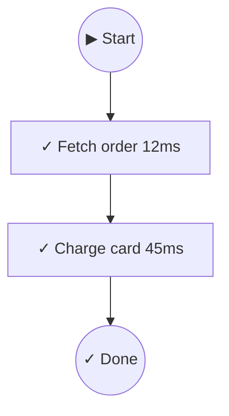

Visualize workflow execution as ASCII diagrams or Mermaid charts for debugging, documentation, or dashboards.

## Basic usage

```typescript
import { createVisualizer } from 'awaitly/visualize';

const viz = createVisualizer({ workflowName: 'checkout' });

const workflow = createWorkflow(deps, {
  onEvent: viz.handleEvent,
});

await workflow(async (step, deps) => {
  const order = await step(() => deps.fetchOrder('123'), { name: 'Fetch order' });
  const payment = await step(() => deps.chargeCard(order.total), { name: 'Charge card' });
  return { order, payment };
});

// ASCII output
console.log(viz.render());

// Mermaid output
console.log(viz.renderAs('mermaid'));
```

## ASCII output

```
┌── checkout ─────────────────────────────────────────────────────┐
│                                                                  │
│  ✓ Fetch order [12ms]                                           │
│  ✓ Charge card [45ms]                                           │
│                                                                  │
│  Completed in 57ms                                               │
│                                                                  │
└──────────────────────────────────────────────────────────────────┘
```

## Mermaid output



Paste into GitHub markdown or any Mermaid-compatible renderer.

## JSON output

Get structured data for custom rendering:

```typescript
const ir = viz.renderAs('json');
// {
//   workflowName: 'checkout',
//   status: 'completed',
//   steps: [...],
//   duration: 57
// }
```

## Naming steps

Give steps descriptive names for better diagrams:

```typescript
const user = await step(() => fetchUser('1'), { name: 'Fetch user' });
const posts = await step(() => fetchPosts(user.id), { name: 'Fetch posts' });
```

Without names, steps show as "unnamed step".

## Parallel operations

Track parallel operations individually:

```typescript
import { allAsync } from 'awaitly';

const result = await workflow(async (step) => {
  const [user, posts] = await step(
    () => allAsync([
      fetchUser('1'),
      fetchPosts('1'),
    ]),
    { name: 'Fetch user data' }
  );
  return { user, posts };
});
```

## Decision tracking

Track conditional logic (if/switch) to visualize branching in your workflows:

### Basic decision tracking

```typescript
import { trackDecision } from 'awaitly/visualize';

const viz = createVisualizer();
const workflow = createWorkflow(deps, {
  onEvent: viz.handleEvent,
});

await workflow(async (step) => {
  const user = await step(() => fetchUser('1'), { name: 'Fetch user' });

  // Track a decision point
  const decision = trackDecision('check-role', {
    condition: "user.role === 'admin'",
    value: user.role,
    emit: viz.handleDecisionEvent,
  });

  if (user.role === 'admin') {
    decision.takeBranch('admin', true);
    await step(() => adminDashboard(user), { name: 'Admin dashboard' });
  } else {
    decision.takeBranch('user', true);
    await step(() => userDashboard(user), { name: 'User dashboard' });
  }

  decision.end();
});
```

### trackIf - Simple if/else

```typescript
import { trackIf } from 'awaitly/visualize';

const decision = trackIf('check-premium', user.isPremium, {
  condition: 'user.isPremium',
  emit: viz.handleDecisionEvent,
});

if (decision.condition) {
  decision.then();
  await step(() => fetchPremiumData(user.id));
} else {
  decision.else();
  await step(() => fetchBasicData(user.id));
}

decision.end();
```

### trackSwitch - Switch statements

```typescript
import { trackSwitch } from 'awaitly/visualize';

const decision = trackSwitch('process-by-role', user.role, {
  condition: 'switch(user.role)',
  emit: viz.handleDecisionEvent,
});

switch (user.role) {
  case 'admin':
    decision.case('admin', true);
    await step(() => processAdmin(user));
    break;
  case 'moderator':
    decision.case('moderator', true);
    await step(() => processModerator(user));
    break;
  default:
    decision.default(true);
    await step(() => processUser(user));
}

decision.end();
```

### With event collector

```typescript
import { createEventCollector, trackIf } from 'awaitly/visualize';

const collector = createEventCollector({ workflowName: 'Role Check' });
const workflow = createWorkflow(deps, {
  onEvent: collector.handleEvent,
});

await workflow(async (step) => {
  const user = await step(() => fetchUser('1'), { name: 'Fetch user' });

  const decision = trackIf('check-role', user.role === 'admin', {
    condition: "user.role === 'admin'",
    value: user.role,
    emit: collector.handleDecisionEvent,
  });

  if (decision.condition) {
    decision.then();
    await step(() => processAdmin(user));
  } else {
    decision.else();
    await step(() => processUser(user));
  }
  decision.end();

  return user;
});

// Visualize with decision tracking
console.log(collector.visualize());
```

## Post-execution visualization

Collect events and visualize later:

```typescript
import { createEventCollector } from 'awaitly/visualize';

const collector = createEventCollector({ workflowName: 'my-workflow' });

const workflow = createWorkflow(deps, {
  onEvent: collector.handleEvent,
});

await workflow(async (step) => { ... });

// Visualize anytime after
console.log(collector.visualize());
console.log(collector.visualizeAs('mermaid'));
```

## Options

```typescript
const viz = createVisualizer({
  workflowName: 'checkout',
  showTimings: true,       // Show step durations (default: true)
  showKeys: false,         // Show step cache keys (default: false)
  detectParallel: true,    // Enable parallel detection (default: true)
});
```

## Integration with logging

```typescript
const workflow = createWorkflow(deps, {
  onEvent: (event) => {
    // Feed to visualizer
    viz.handleEvent(event);

    // Also log
    if (event.type === 'step_complete') {
      logger.info(`Step ${event.name} completed in ${event.durationMs}ms`);
    }
    if (event.type === 'step_error') {
      logger.error(`Step ${event.name} failed:`, event.error);
    }
  },
});
```

## Devtools

For interactive debugging, run comparison, and timeline analysis:

```typescript
import { createDevtools, quickVisualize, createConsoleLogger } from 'awaitly/devtools';

const devtools = createDevtools({ workflowName: 'checkout' });

const workflow = createWorkflow(deps, {
  onEvent: devtools.handleEvent,
});

await workflow(async (step) => { ... });

// Get current run
const currentRun = devtools.getCurrentRun();

// Get execution history
const history = devtools.getHistory();

// Compare runs
const diff = devtools.diff(run1.id, run2.id);
console.log(renderDiff(diff));

// Compare with previous run
const diffWithPrev = devtools.diffWithPrevious();

// Render timeline
console.log(devtools.renderTimeline());

// Export/import runs
const json = devtools.exportRun();
const imported = devtools.importRun(json);
```

### Console logging

Use `createConsoleLogger` for pretty console output:

```typescript
import { createConsoleLogger } from 'awaitly/devtools';

const logger = createConsoleLogger({ prefix: '[workflow]', colors: true });

const workflow = createWorkflow(deps, {
  onEvent: logger,
});

await workflow(async (step) => { ... });
// Output:
// [workflow] ⏵ Workflow started
// [workflow] → fetch-user
// [workflow] ✓ fetch-user (12ms)
// [workflow] ✓ Workflow completed (45ms)
```

### Quick visualization

Visualize a workflow run without setting up a visualizer:

```typescript
import { quickVisualize } from 'awaitly/devtools';

const result = await quickVisualize(
  async (handleEvent) => {
    const workflow = createWorkflow(deps, { onEvent: handleEvent });
    return await workflow(async (step) => { ... });
  },
  { workflowName: 'my-workflow' }
);

console.log(result); // ASCII diagram
```

### Run comparison

Compare two workflow runs to see what changed:

```typescript
const diff = devtools.diff(run1.id, run2.id);

if (diff.statusChange) {
  console.log(`Status: ${diff.statusChange.from} → ${diff.statusChange.to}`);
}

if (diff.durationChange) {
  console.log(`Duration: ${diff.durationChange > 0 ? '+' : ''}${diff.durationChange}ms`);
}

// See what steps were added/removed/changed
console.log('Added:', diff.added);
console.log('Removed:', diff.removed);
console.log('Changed:', diff.changed);
```

### Timeline analysis

Get detailed timeline data:

```typescript
const timeline = devtools.getTimeline();

for (const entry of timeline) {
  console.log(`${entry.name}: ${entry.status} (${entry.durationMs}ms)`);
  if (entry.error) {
    console.error(`  Error: ${entry.error}`);
  }
}
```

## Advanced features

### Time-travel debugging

Step through workflow execution history:

```typescript
import { createTimeTravelController } from 'awaitly/visualize';

const controller = createTimeTravelController({ maxSnapshots: 1000 });

const workflow = createWorkflow(deps, {
  onEvent: controller.handleEvent,
});

await workflow(async (step) => { ... });

// Navigate through execution history
controller.seek(0);              // Go to start
controller.stepForward();        // Step forward one event
controller.stepBackward();      // Step backward one event
controller.seek(10);            // Jump to event 10
controller.play(2.0);            // Playback at 2x speed
controller.pause();              // Pause playback

// Get current state
const ir = controller.getCurrentIR();
const state = controller.getState();
```

### Performance analyzer

Identify slow steps with heatmap visualization:

```typescript
import { createPerformanceAnalyzer, getHeatLevel } from 'awaitly/visualize';

const analyzer = createPerformanceAnalyzer();

const workflow = createWorkflow(deps, {
  onEvent: analyzer.handleEvent,
});

await workflow(async (step) => { ... });

// Get performance data
const data = analyzer.getData();
const heatLevel = getHeatLevel(stepDuration, data);

// Export for visualization
const json = analyzer.exportData();
```

### Live visualizer

Real-time visualization as workflow executes:

```typescript
import { createLiveVisualizer } from 'awaitly/visualize';

const visualizer = createLiveVisualizer({ workflowName: 'checkout' });

// Subscribe to updates
visualizer.onUpdate((ir) => {
  console.log('Workflow state updated:', ir);
  // Update UI, render diagram, etc.
});

const workflow = createWorkflow(deps, {
  onEvent: visualizer.handleEvent,
});

await workflow(async (step) => { ... });
```

### Dev server

Interactive web-based visualization with time-travel and performance analysis:

```typescript
import { createDevServer } from 'awaitly/visualize';

const server = await createDevServer({
  port: 3377,
  workflowName: 'checkout',
  timeTravel: true,
  heatmap: true,
});

await server.start();
// Opens browser at http://localhost:3377

const workflow = createWorkflow(deps, {
  onEvent: server.handleEvent,
});

await workflow(async (step) => { ... });

server.complete();
// Later, when done
await server.stop();
```

The dev server provides:
- Interactive HTML visualization
- Time-travel debugging controls
- Performance heatmap
- Real-time updates via WebSocket
- Export/import workflow runs

## Next

[Learn about Testing →](../testing/)
