import { Aside } from '@astrojs/starlight/components';

Visualize workflow execution as ASCII diagrams or Mermaid charts for debugging, documentation, or dashboards. Use **`step('id', fn, opts)`** so step IDs appear as stable labels in diagrams and in [statically generated docs](/docs/guides/static-analysis/).

**Packages:** Runtime visualization uses **`awaitly-visualizer`** (`createVisualizer`, event handling, Mermaid/ASCII/JSON). The **`awaitly-visualizer`** app is an optional React UI that loads workflow diagrams (e.g. from static analysis or exported JSON). To capture events you must wire **`onEvent`** into your workflow (see [Capturing events](#capturing-events)).

## How it works

Visualization is a three-stage pipeline: the workflow runtime emits typed **events** through `onEvent`, an internal IR builder assembles them into an **IR tree**, and a **renderer** walks the tree to produce output. You pick the renderer; everything else is automatic.

```
Workflow ──onEvent──▶ IR Builder ──▶ IR Tree ──▶ Renderer ──▶ Output
(step_start, scope_start, ...)     (WorkflowIR)   (ascii, mermaid, json, ...)
```

- **Events** — the workflow runtime emits typed events through `onEvent`. Key types: `step_start`, `step_success`, `step_error`, `step_retry`, `scope_start`/`scope_end` (parallel/race), `step_skipped`, and `decision_*`.
- **IR** — the builder processes events into a tree of typed nodes (`StepNode`, `ParallelNode`, `RaceNode`, `DecisionNode`) under a root `WorkflowNode`. This is the `WorkflowIR`.
- **Renderers** — each renderer walks the same IR tree. ASCII draws box-art, Mermaid generates `flowchart TD`, JSON serializes the IR directly.

<Aside type="tip">
You never interact with the IR builder directly. `createVisualizer` wires it up internally. The IR is exposed via `viz.getIR()` and the `json` format for advanced use cases.
</Aside>

## Basic usage

```typescript
import { ok, err, type Result } from 'awaitly';
import { createWorkflow } from 'awaitly/workflow';
import { createVisualizer } from 'awaitly-visualizer';

// Define your dependencies with Result-returning functions
const deps = {
  fetchOrder: async (id: string): Promise<Result<Order, OrderNotFound>> => {
    const order = await db.orders.find(id);
    return order ? ok(order) : err({ type: 'ORDER_NOT_FOUND', id });
  },
  chargeCard: async (amount: number): Promise<Result<Payment, PaymentFailed>> => {
    const result = await paymentGateway.charge(amount);
    return result.success
      ? ok(result.payment)
      : err({ type: 'PAYMENT_FAILED', reason: result.error });
  },
};

const viz = createVisualizer({ workflowName: 'checkout' });

const workflow = createWorkflow('workflow', deps, {
  onEvent: viz.handleEvent,
});

await workflow.run(async ({ step, deps }) => {
  const order = await step('fetchOrder', () => deps.fetchOrder('123'));
  const payment = await step('chargeCard', () => deps.chargeCard(order.total));
  return { order, payment };
});

// ASCII output
console.log(viz.render());

// Mermaid output
console.log(viz.renderAs('mermaid'));
```

## Capturing events

Events are only received by the visualizer when the workflow runtime calls your **`onEvent`** callback. That happens only if:

1. **You pass `onEvent` at workflow creation** — e.g. `createWorkflow('name', deps, { onEvent: viz.handleEvent })`.
2. **Or you pass it at execution time** — e.g. `workflow.run(fn, { onEvent: viz.handleEvent })`, if your workflow API supports execution options.

If you wrap the workflow in a library (e.g. `processOnePayment(batch, payment, deps, { onEvent })`), the library must **accept** an optional `onEvent` (or full workflow options) and **forward** it to `createWorkflow` or to the executor. Otherwise the visualizer will never receive events.

- **Direct usage:** Always pass `onEvent: viz.handleEvent` (or `collector.handleEvent`) where you call `createWorkflow`.
- **Library authors:** Accept `workflowOptions?: { onEvent?, ... }` and spread them into `createWorkflow(..., workflowOptions)`. See [Library workflows](/docs/guides/visualization/#library-workflows) below.

If the diagram is empty or only shows "workflow_start", check that (1) `onEvent` is passed and (2) the workflow actually runs steps (so `step_start` / `step_complete` events are emitted). For an optional file-based capture (e.g. writing the last run to a `cursor_events` folder), see [event-capture in the awaitly-visualizer package](https://github.com/jagreehal/awaitly/tree/main/packages/awaitly-visualizer/src/event-capture) in the repo.

## Library workflows

When your workflow is created inside a library (e.g. a payment or checkout module), callers need a way to pass visualization (or other) options. Expose an optional options argument and forward it to `createWorkflow`:

```typescript
// Library: accept optional workflow options
export async function processOnePayment(
  args: ProcessOnePaymentArgs,
  deps: PaymentWorkflowDeps,
  workflowOptions?: { onEvent?: (event: WorkflowEvent<...>) => void }
) {
  const workflow = createWorkflow("processOnePayment", deps, {
    catchUnexpected: ...,
    ...workflowOptions,  // so callers can pass onEvent
  });
  const args = input; return workflow.run(async ({ step, deps }) => { ... });
}

// Caller: capture events for visualization
const viz = createVisualizer({ workflowName: "processOnePayment" });
const result = await processOnePayment(batch, payment, deps, {
  onEvent: viz.handleEvent,
});
console.log(viz.renderAs("mermaid"));
```

## Migration from manual logging

If you're currently using manual `onEvent` logging, here's how to migrate to `createVisualizer`:

### Before: Manual logging

```typescript
const workflow = createWorkflow('workflow', deps, {
  onEvent: (event) => {
    if (event.type === 'step_start') {
      console.log(`Starting: ${event.name}`);
    }
    if (event.type === 'step_complete') {
      console.log(`Completed: ${event.name} in ${event.durationMs}ms`);
    }
    if (event.type === 'step_error') {
      console.error(`Failed: ${event.name}`, event.error);
    }
  },
});
```

### After: Using createVisualizer

```typescript
import { createVisualizer } from 'awaitly-visualizer';

const viz = createVisualizer({ workflowName: 'checkout' });
const workflow = createWorkflow('workflow', deps, {
  onEvent: viz.handleEvent,
});

// Run workflow...
console.log(viz.render()); // ASCII diagram with all steps
```

### Benefits comparison

| Feature | Manual Logging | createVisualizer |
|---------|---------------|------------------|
| Timing per step | Manual calculation | Automatic |
| Error formatting | Custom | Structured |
| Parallel detection | Not supported | Automatic |
| Output formats | Text only | ASCII, Mermaid, JSON, Flowchart |
| Diagram generation | Not supported | Built-in |
| Post-execution analysis | Manual | Built-in |

## ASCII output

```
┌── checkout ──────────────────────────────────────────────────────┐
│                                                                  │
│  ✓ Fetch order [12ms]                                            │
│  ✓ Charge card [45ms]                                            │
│                                                                  │
│  Completed in 57ms                                               │
│                                                                  │
└──────────────────────────────────────────────────────────────────┘
```

## Mermaid output

```mermaid
flowchart TD
    start((\"▶ Start\"))
    step_fetch_order[✓ Fetch order 12ms]:::success
    start --> step_fetch_order
    step_charge_card[✓ Charge card 45ms]:::success
    step_fetch_order --> step_charge_card
    finish((\"✓ Done\")):::success
    step_charge_card --> finish
```

Paste into GitHub markdown or any Mermaid-compatible renderer.

## JSON output

Get structured data for custom rendering:

```typescript
const ir = viz.renderAs('json');
// {
//   workflowName: 'checkout',
//   status: 'completed',
//   steps: [...],
//   duration: 57
// }
```

## Naming steps

Use a descriptive string as the first argument (step id) for better diagrams:

```typescript
const user = await step('Fetch user', () => fetchUser('1'));
const posts = await step('Fetch posts', () => fetchPosts(user.id));
```

The step id is used for visualization and step identification.

## Parallel operations

Track parallel operations with `step.parallel(name, ...)`:

```typescript
import { allAsync } from 'awaitly';

const result = await workflow.run(async ({ step, deps }) => {
  const [user, posts] = await step.parallel('Fetch user data', () =>
    allAsync([deps.fetchUser('1'), deps.fetchPosts('1')])
  );
  return { user, posts };
});
```

## Retry visualization

Retries are tracked automatically — the retry count appears in both ASCII and Mermaid output.

```typescript
const payment = await step.retry(
  'Fetch from API',
  () => deps.fetchFromApi(),
  { attempts: 3, backoff: 'exponential', initialDelay: 100 }
);
```

In ASCII output, retries appear as a suffix after the timing:

```
✓ Fetch from API [320ms] [2 retries]
```

In Mermaid output, retries render as a dashed self-loop edge:

```mermaid
flowchart TD
    step_fetch["✓ Fetch from API 320ms"]:::success
    step_fetch -.->|"↻ 2 retries"| step_fetch
```



See [Retries & Timeouts](/guides/retries-timeouts/) for the full retry API.

## Race visualization

`step.race()` with `anyAsync()` shows all branches, highlights the winner, and marks losers as cancelled.

```typescript
import { anyAsync } from 'awaitly';

const estimate = await step.race('Shipping estimate', () =>
  anyAsync([
    step('getPrimaryShipping', () => deps.getPrimaryShipping()),
    step('getFallbackShipping', () => deps.getFallbackShipping()),
  ])
);
```

In ASCII output, the race scope uses a `⚡` indicator with winner/loser annotations:

```
├⚡ ✓ Shipping estimate
│ ├ ✓ getPrimaryShipping [5ms] (winner)
│ └ ⊘ getFallbackShipping
└── [5ms]
```

In Mermaid output, the winner gets a thick arrow and losers get dashed "cancelled" edges:

```mermaid
flowchart TD
    subgraph race_1["⚡ Shipping estimate"]
        race_1_start(("🏁 Start"))
        step_primary["✓ getPrimaryShipping 5ms"]:::success
        step_fallback["⊘ getFallbackShipping"]:::aborted
        race_1_end(("✓ First"))
        race_1_start --> step_primary
        race_1_start --> step_fallback
        step_primary ==>|🏆 Winner| race_1_end
        step_fallback -. cancelled .-> race_1_end
    end
```



<Aside type="note">
Operations inside `anyAsync()` must be wrapped with `step()` individually to appear as separate nodes. Otherwise the race scope shows "(operations not individually tracked)".
</Aside>

## Conditional execution

`when()` from `awaitly/conditional` skips steps with a `step_skipped` event, rendered as `⊘` in diagrams.

```typescript
import { when } from 'awaitly/conditional';

const discount = await when(
  user.isPremium,
  () => step('Apply discount', () => deps.applyDiscount(order)),
  { name: 'Apply discount', key: 'apply-discount', reason: 'User is not premium' },
  { workflowId: ctx.workflowId, onEvent: ctx.onEvent }
);
```

When the condition is `false`, the step is skipped. In ASCII output, skipped steps appear dimmed:

```
⊘ Apply discount
```

In Mermaid output, skipped steps get a `:::skipped` class with a dashed border.

To avoid passing `ctx` every time, use `createConditionalHelpers`:

```typescript
import { createConditionalHelpers } from 'awaitly/conditional';

const { when, unless } = createConditionalHelpers({
  workflowId: ctx.workflowId,
  onEvent: ctx.onEvent,
});

// No need to pass ctx — it's bound automatically
const discount = await when(
  user.isPremium,
  () => step('Apply discount', () => deps.applyDiscount(order)),
  { name: 'Apply discount' }
);
```

<Aside type="note">
`when()` emits a single `step_skipped` event. For full branching visualization with multiple paths, use `trackIf`/`trackSwitch` (below).
</Aside>

## Decision tracking

Track conditional logic (if/switch) to visualize branching in your workflows:

### Basic decision tracking

```typescript
import { trackDecision } from 'awaitly-visualizer';

const viz = createVisualizer();
const workflow = createWorkflow('workflow', deps, {
  onEvent: viz.handleEvent,
});

await workflow.run(async ({ step, deps }) => {
  const user = await step('Fetch user', () => deps.fetchUser('1'));

  // Track a decision point
  const decision = trackDecision('check-role', {
    condition: \"user.role === 'admin'\",
    value: user.role,
    emit: viz.handleDecisionEvent,
  });

  if (user.role === 'admin') {
    decision.takeBranch('admin', true);
    await step('Admin dashboard', () => adminDashboard(user));
  } else {
    decision.takeBranch('user', true);
    await step('User dashboard', () => userDashboard(user));
  }

  decision.end();
});
```

### trackIf - Simple if/else

```typescript
import { trackIf } from 'awaitly-visualizer';

const decision = trackIf('check-premium', user.isPremium, {
  condition: 'user.isPremium',
  emit: viz.handleDecisionEvent,
});

if (decision.condition) {
  decision.then();
  await step('fetchPremiumData', () => fetchPremiumData(user.id));
} else {
  decision.else();
  await step('fetchBasicData', () => fetchBasicData(user.id));
}

decision.end();
```

### trackSwitch - Switch statements

```typescript
import { trackSwitch } from 'awaitly-visualizer';

const decision = trackSwitch('process-by-role', user.role, {
  condition: 'switch(user.role)',
  emit: viz.handleDecisionEvent,
});

switch (user.role) {
  case 'admin':
    decision.case('admin', true);
    await step('processAdmin', () => processAdmin(user));
    break;
  case 'moderator':
    decision.case('moderator', true);
    await step('processModerator', () => processModerator(user));
    break;
  default:
    decision.default(true);
    await step('processUser', () => processUser(user));
}

decision.end();
```

### With event collector

```typescript
import { createEventCollector, trackIf } from 'awaitly-visualizer';

const collector = createEventCollector({ workflowName: 'Role Check' });
const workflow = createWorkflow('workflow', deps, {
  onEvent: collector.handleEvent,
});

await workflow.run(async ({ step, deps }) => {
  const user = await step('Fetch user', () => deps.fetchUser('1'));

  const decision = trackIf('check-role', user.role === 'admin', {
    condition: \"user.role === 'admin'\",
    value: user.role,
    emit: collector.handleDecisionEvent,
  });

  if (decision.condition) {
    decision.then();
    await step('processAdmin', () => processAdmin(user));
  } else {
    decision.else();
    await step('processUser', () => processUser(user));
  }
  decision.end();

  return user;
});

// Visualize with decision tracking
console.log(collector.visualize());
```

## Post-execution visualization

Collect events and visualize later:

```typescript
import { createEventCollector } from 'awaitly-visualizer';

const collector = createEventCollector({ workflowName: 'my-workflow' });

const workflow = createWorkflow('workflow', deps, {
  onEvent: collector.handleEvent,
});

await workflow.run(async ({ step, deps }) => { ... });

// Visualize anytime after
console.log(collector.visualize());
console.log(collector.visualizeAs('mermaid'));
```

## Reset and multiple runs

Two mechanisms keep the visualizer in sync when you run a workflow more than once:

- **Automatic**: Each `workflow_start` event clears previous IR state. Reusing the same visualizer across runs means only the latest run is visible.
- **Manual**: `viz.reset()` clears all state explicitly.

Automatic replacement — only the second run is visible:

```typescript
const viz = createVisualizer({ workflowName: 'checkout' });
const workflow = createWorkflow('checkout', deps, { onEvent: viz.handleEvent });

// Run A
await workflow.run(async ({ step, deps }) => {
  await step('Fetch order', () => deps.fetchOrder('A'));
});
console.log(viz.render()); // shows Fetch order (run A)

// Run B — automatically replaces run A
await workflow.run(async ({ step, deps }) => {
  await step('Charge card', () => deps.chargeCard(100));
});
console.log(viz.render()); // shows Charge card (run B) only
```

Manual reset:

```typescript
viz.reset(); // clears all state — getIR() returns an empty workflow
```

## Options

```typescript
const viz = createVisualizer({
  workflowName: 'checkout',
  showTimings: true,       // Show step durations (default: true)
  showKeys: false,         // Show step cache keys (default: false)
  detectParallel: true,    // Enable parallel detection (default: true)
});
```

## IR tree structure

The IR is the data model connecting events to renderers. It's exposed for custom renderers and programmatic inspection via `viz.getIR()`.

```typescript
const ir = viz.getIR();

console.log(ir.root);            // WorkflowNode — the root of the tree
console.log(ir.root.children);   // FlowNode[] — top-level steps, parallels, races, etc.
console.log(ir.metadata);        // { createdAt, lastUpdatedAt }
```

### Node types

| Type | Node | Created by | Key fields |
|------|------|------------|------------|
| Step | `StepNode` | `step()`, `step.retry()` | `state`, `durationMs`, `retryCount?`, `timedOut?` |
| Parallel | `ParallelNode` | `step.parallel()` | `children`, `mode: "all" \| "allSettled"` |
| Race | `RaceNode` | `step.race()` | `children`, `winnerId?` |
| Decision | `DecisionNode` | `trackIf`, `trackSwitch` | `branches`, `branchTaken?` |
| Stream | `StreamNode` | streaming ops | `namespace`, `writeCount`, `readCount` |

### Step states

Each node has a `state` field. The visualizer maps states to symbols:

| State | Symbol | Description |
|-------|--------|-------------|
| `pending` | `○` | Not yet started |
| `running` | `⟳` | Currently executing |
| `success` | `✓` | Completed successfully |
| `error` | `✗` | Failed with error |
| `aborted` | `⊘` | Cancelled (e.g. race loser) |
| `cached` | `↺` | Result served from cache |
| `skipped` | `⊘` | Skipped by conditional |

### Type guards

Use type guards from `awaitly-visualizer` for programmatic inspection:

```typescript
import {
  isStepNode,
  isParallelNode,
  isRaceNode,
  isDecisionNode,
  isStreamNode,
  hasChildren,
  type FlowNode,
} from 'awaitly-visualizer';

function walkTree(node: FlowNode) {
  if (isStepNode(node)) {
    console.log(`Step: ${node.name} [${node.state}]`);
  } else if (isRaceNode(node)) {
    console.log(`Race: winner=${node.winnerId}`);
    node.children.forEach(walkTree);
  } else if (hasChildren(node)) {
    node.children.forEach(walkTree);
  }
}

const ir = viz.getIR();
ir.root.children.forEach(walkTree);
```

## Convenience APIs

### combineEventHandlers

Combine multiple event handlers for visualization + logging + metrics:

```typescript
import { createVisualizer, combineEventHandlers } from 'awaitly-visualizer';

const viz = createVisualizer({ workflowName: 'checkout' });

const workflow = createWorkflow('workflow', deps, {
  onEvent: combineEventHandlers(
    viz.handleEvent,
    (e) => console.log(e.type),
    (e) => metrics.track(e),
  ),
});
```

## When to use each renderer

| Renderer | Best For | Example Use |
|----------|----------|-------------|
| ASCII | Terminal debugging | Quick inspection during development |
| Mermaid | Documentation | GitHub READMEs, Confluence pages |
| Logger | Production | Structured logging with Pino/Winston |
| Flowchart | Complex workflows | Box-and-arrow diagrams in terminal |
| JSON | Custom rendering | Building custom UIs or dashboards |

### ASCII renderer

Best for terminal-based debugging during development:

```typescript
const output = viz.renderAs('ascii');
// ┌── checkout ──────────────────────────────────────────┐
// │  ✓ Fetch order [12ms]                                │
// │  ✓ Charge card [45ms]                                │
// │  Completed in 57ms                                   │
// └──────────────────────────────────────────────────────┘
```

### Mermaid renderer

Best for documentation that renders in GitHub, Confluence, or other Markdown viewers:

```typescript
const mermaid = viz.renderAs('mermaid');
// flowchart TD
//     start((\"▶ Start\"))
//     step_1[✓ Fetch order 12ms]:::success
//     ...
```

### Logger renderer

Best for production logging with structured output:

```typescript
import { loggerRenderer } from 'awaitly-visualizer';

const renderer = loggerRenderer();
const output = renderer.render(viz.getIR(), {
  showTimings: true,
  showKeys: false,
  colors: { success: 'green', error: 'red', ... },
});
```

### Flowchart renderer

Best for complex workflows with box-and-arrow diagrams:

```typescript
const flowchart = viz.renderAs('flowchart');
// ╭──────────────────╮
// │   Fetch order    │
// ╰────────┬─────────╯
//          │
//          ▼
// ╭──────────────────╮
// │   Charge card    │
// ╰──────────────────╯
```

## Integration patterns

### Express middleware

Log and visualize workflows in HTTP handlers:

```typescript
import { createEventCollector } from 'awaitly-visualizer';

app.post('/checkout', async (req, res) => {
  const collector = createEventCollector({ workflowName: 'checkout' });

  const workflow = createWorkflow('workflow', deps, {
    onEvent: collector.handleEvent,
  });

  const result = await workflow.run(async ({ step, deps }) => {
    const order = await step('Fetch order', () => deps.fetchOrder(req.body.orderId));
    const payment = await step('Charge card', () => deps.chargeCard(order.total));
    return { order, payment };
  });

  // Log visualization on error for debugging
  if (!result.ok) {
    logger.error('Checkout failed', {
      visualization: collector.visualize(),
      events: collector.getEvents(),
    });
    return res.status(500).json({ error: result.error });
  }

  res.json(result.value);
});
```

### Event collector for batched logging

Collect events across multiple workflow runs for aggregated analysis:

```typescript
import { createEventCollector } from 'awaitly-visualizer';

const allEvents: CollectableEvent[] = [];

const workflow = createWorkflow('workflow', deps, {
  onEvent: (e) => allEvents.push(e),
});

// Run multiple workflows
await workflow.run(async ({ step, deps }) => { ... });
await workflow.run(async ({ step, deps }) => { ... });
```

### CI/CD artifact generation

Generate Mermaid diagrams as build artifacts:

```typescript
import fs from 'fs';
import { createVisualizer } from 'awaitly-visualizer';
import { createWorkflow } from 'awaitly/workflow';

const viz = createVisualizer({ workflowName: 'deployment' });

const workflow = createWorkflow('workflow', deps, {
  onEvent: viz.handleEvent,
});

await workflow.run(async ({ step, deps }) => {
  await step('Run tests', () => deps.runTests());
  await step('Build app', () => deps.buildApp());
  await step('Deploy', () => deps.deploy());
});

// Write Mermaid diagram to artifacts
const mermaid = viz.renderAs('mermaid');
fs.writeFileSync('artifacts/workflow-diagram.md', `\\`\\`\\`mermaid\\n${mermaid}\\n\\`\\`\\``);
```

## Next

[Learn about Testing →](/guides/testing/)

