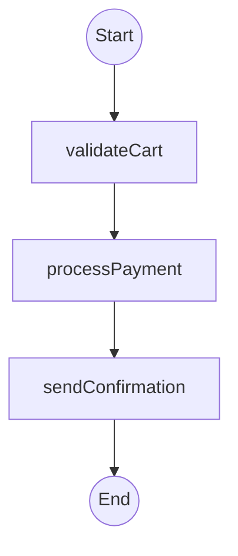

# awaitly-analyze

Static workflow analysis for [awaitly](https://www.npmjs.com/package/awaitly). Analyze workflow source code to extract structure and generate visualizations without executing the workflow.

## Features

- **Static Analysis** - Extract workflow structure from source code using tree-sitter
- **WASM-based** - No native dependencies, works in Node.js and browsers
- **Mermaid Diagrams** - Generate flowchart visualizations
- **Full Pattern Support** - Detects steps, conditionals, loops, parallel/race execution, and workflow composition

## Installation

```bash
npm install awaitly-analyze
# or
pnpm add awaitly-analyze
```

> **Note:** This package requires `awaitly` as a peer dependency.

## Usage

### Analyze a workflow file

```typescript
import { analyzeWorkflow, renderStaticMermaid } from 'awaitly-analyze';

// Analyze a TypeScript file containing awaitly workflows
const results = await analyzeWorkflow('./src/workflows/checkout.ts');

// Generate a Mermaid diagram
for (const ir of results) {
  console.log(`Workflow: ${ir.root.workflowName}`);
  console.log(renderStaticMermaid(ir));
}
```

### Analyze source code directly

```typescript
import { analyzeWorkflowSource, renderStaticMermaid } from 'awaitly-analyze';

const source = `
import { createWorkflow } from 'awaitly';

const checkout = createWorkflow({
  validateCart: async (cart) => { /* ... */ },
  processPayment: async (payment) => { /* ... */ },
  sendConfirmation: async (order) => { /* ... */ },
});

export const run = checkout(async ({ step, deps }) => {
  const cart = await step(() => deps.validateCart(items));
  const order = await step(() => deps.processPayment(cart));
  return step(() => deps.sendConfirmation(order));
});
`;

const results = await analyzeWorkflowSource(source, 'checkout.ts');
console.log(renderStaticMermaid(results[0]));
```

### Output



## CLI

```bash
# Analyze a workflow file
npx awaitly-analyze ./src/workflows/checkout.ts

# Output as JSON
npx awaitly-analyze ./src/workflows/checkout.ts --json
```

## API

### `analyzeWorkflow(filePath, options?)`

Analyze a TypeScript file containing awaitly workflows.

```typescript
const results = await analyzeWorkflow('./workflow.ts', {
  includeLocations: true,  // Include source locations (default: true)
});
```

### `analyzeWorkflowSource(source, filename?, options?)`

Analyze workflow source code directly.

```typescript
const results = await analyzeWorkflowSource(sourceCode, 'workflow.ts');
```

### `renderStaticMermaid(ir, options?)`

Generate a Mermaid flowchart from the analysis result.

```typescript
const mermaid = renderStaticMermaid(ir, {
  direction: 'TB',        // 'TB' | 'LR' (default: 'TB')
  showConditions: true,   // Show condition labels (default: true)
});
```

### `renderStaticJSON(ir, options?)`

Export the analysis result as JSON.

```typescript
const json = renderStaticJSON(ir, { pretty: true });
```

## What Gets Detected

| Pattern | Example | Detected |
|---------|---------|----------|
| Steps | `step(() => fn())` | ✅ |
| Retry | `step.retry(() => fn(), { attempts: 3 })` | ✅ |
| Timeout | `step.withTimeout(() => fn(), { ms: 5000 })` | ✅ |
| Parallel | `allAsync([...])`, `step.parallel({...})` | ✅ |
| Race | `anyAsync([...])`, `step.race([...])` | ✅ |
| Conditionals | `if/else`, `when()`, `unless()` | ✅ |
| Loops | `for`, `for...of`, `while` | ✅ |
| Workflow refs | Nested workflow calls | ✅ |

## License

MIT
